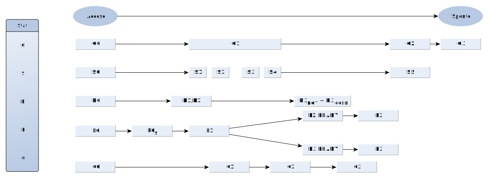

title: "Gestione dell'alimentazione, parte 1: definizione degli stati ACPI"
date: 2017-08-19T10:00:00Z
template: blogpost.php
author: Federico Bassignana
abstract: Questo è il primo di una serie di articoli riguardanti le tecniche utilizzate dalle case produttrici di pc per gestire il sistema di alimentazione nei loro dispositivi. Quanto scritto fa riferimento all'elettronica presente nei laptop ma, a livello teorico, non si discosta di molto ciò che avviene anche nei desktop; mentre a livello pratico le cose posso essere abbastanza diverse, infatti i desktop verranno trattati più avanti. 
---
## Introduzione
Questo è il primo di una serie di articoli riguardanti le tecniche utilizzate dalle case produttrici di pc per gestire il sistema di alimentazione nei loro dispositivi. 
Quanto scritto fa riferimento all'elettronica presente nei laptop ma, a livello teorico, non si discosta di molto ciò che avviene anche nei desktop; mentre a livello pratico 
le cose posso essere abbastanza diverse, infatti i desktop verranno trattati più avanti. 
 
Nel corso degli anni le maggiori case produttrici hanno sviluppato in comune accordo standard di gestione energetica al fine di avere una maggiore compatibilità tra i loro dispositivi.
Nel 1992 venne introdotto lo standard **APM** (*Advanced Power Management*), tuttavia presto diventato obsoleto a causa di una sempre maggiore necessità di risparmio energetico.
Venne infatti rimpiazzato dalla [specifica **ACPI**](http://www.uefi.org/acpi/specs) (*Advanced Configuration and Power Interface*), di cui si occupa questo articolo e che permette un controllo completo dell'alimentazione direttamente dal sistema operativo, a differenza del precedente metodo che ne permetteva la gestione solo attraverso il BIOS.
 
La specifica ACPI definisce, tra le altre cose, degli **stati** che descrivono il comportamento delle principali componenti del computer in base al risparmio energetico desiderato. Quindi di fatto la specifica definisce ogni componente, nonché l'intero computer, come una macchina a stati finiti, dal punto di vista della gestione energetica.  
In generale gli stati 0 (G0, S0, D0, etc...) sono stati attivi, in cui il sistema è disponibile all'utente, mentre gli altri sono stati "addormentati", dove un numero più alto corrisponde a minori consumi e maggiore tempo per tornare allo stato attivo.
 
La specifica ACPI fa riferimento in vari punti al contesto del sistema (*system context*) e al contesto del dispositivo (*device context*): questi non sono altro che "dati variabili" memorizzati nel dispositivo e necessari al suo immediato funzionamento. Ad esempio, su una CPU il contesto potrebbe indicare il contenuto dei registri, su un dispositivo USB il suo indirizzo sul bus, e così via.
La specifica stabilisce in quali stati i contesti devono essere mantenuti, in quali possono essere persi, e in quali vengono persi dall'hardware ma è richiesto al sistema operativo di implementare un metodo per salvarli in modo permanente.
  
## Stati G (Sistema Globale)
Sono stati che descrivono la percezione che ha l'utente finale del sistema complessivo, cioè del computer.

* _G0_: 
    * Il sistema è completamente funzionante e alimentato con il 100% dell'energia a disposizione
    * Alcuni dispositivi in quel momento inutilizzati potrebbero essere in uno stato "addormentato", purché possano tornare a uno stato di funzionamento in tempi brevi
* _G1_ "Sistema addormentato": 
    * Il pc sembra spento pur non essendolo effettivamente, i consumi in generale sono ridotti
    * La sessione di lavoro può essere ripristinata senza necessariamente riavviare il sistema
    * I contesti relativi ai processi sono salvati in memoria
* _G2_ Spegnimento soft:
    * Il pc comsuma piccole quantità di energia, infatti ad esempio nei computer conformi allo standard ATX l'alimentatore fornisce la tensione di *5 V standby* alla scheda madre
    * Il sistema risulta spento a tutti gli effetti ma è possibile riavviare il sistema mediante Wake On LAN
    * lo spegnimento avviene via software (dall'OS) oppure mediante il pulsante presente sul case dei computer, corrispondente al tasto per l'accensione
    * Per ripristinare la sessione di lavoro c'è un'alta latenza (riavvio del sistema)
    * Nessun contesto viene salvato
* _G3_ Spegnimento meccanico:
    * Azionato da un comando meccanico (tasto ON/OFF), equivale a staccare fisicamente il cavo di alimentazione e la batteria se presente
    * Il sistema deve essere riacceso col medesimo tasto (non è possibile ricorrere al Wake On LAN o al normale tasto di accensione), poi riavviato per ripristinare la sessione.
    * Un esempio può essere il tasto presente sul retro di molti alimentatori desktop, che spegne completamente l'alimentatore (le uniche componenti del computer che restano alimentate sono il modulo RTC e la "memoria CMOS", tramite la "batteria CMOS")
    * Non viene consumata energia

## Stati S
Sono stati che descrivono cosa accade a livello di sistema. S0 è associato a G0, S1-S4 si trovano all'interno di G1 e S5 è associato a G2. 

* _S0_ Stato attivo:
    * Il computer è alimentato, l'utente finale utilizza l'apparecchio
* _S1_ / _S2_ Stati "addormentati" (solitamente inutilizzati): 
    * _S1_:
        * Breve tempo di riaccensione
        * Nessun contesto viene perso
    * _S2_:
        * Breve tempo di riaccensione
        * Vengono persi il contesto della CPU e le cache 
* _S3_ Stato "addormentato" (e.g. stand-by, sospensione in RAM):
    * Breve tempo di ripristino della sessione
    * Prima di entrare nello stato il sistema operativo salva nella RAM i contesti di tutte le unità come CPU, chipset e dispositivi di I/O, che vengono spenti
    * Al "risveglio" il sistema operativo ripristina i contesti dalla RAM. Questo permette un risveglio del sistema piuttosto rapido ma l'inconveniente è che se viene a mancare corrente la sessione di lavoro viene persa, in quanto la RAM è volatile  
* _S4_ Stato "addormentato" (e.g. ibernazione, sospensione su hard disk):
    * Alta latenza per tornare allo stato attivo (_S0_)
    * In questo livello anche la RAM viene spenta
    * Prima di entrare nello stato il sistema operativo salva tutti i contesti del sistema in un file su memoria di massa (letteralmente *Memory image* → copia della memoria virtuale dei processi, in pratica l'intero contenuto della RAM viene salvato in un file)
    * Al risveglio il sistema operativo ripristina i contesti dal file
* _S5_ Spegnimento software:
    * Simile allo stato _S4_ ma il sistema operativo non salva nessun contesto
    * Per riavviare la sessione è necessario un riavvio completo del sistema operativo

### Stati addizionali
	
## Stati C

Descrivono il comportamento della CPU. Si trovano tutti all'interno dello stato G0.

* _C0_:
    * La CPU esegue le istruzioni normalmente
* _C1_:
    * La CPU si trova in uno stato in cui *non* esegue istruzioni
    * Bassa latenza di ripristino della sessione 
* _C2_:
	* È necessario più tempo per "risvegliare il sistema", cioè tornare allo stato C0, ma i consumi sono più bassi rispetto allo stato C1
* _C3_:
	* Richiede più tempo per il risveglio
    * Le cache non vengono più aggiornate quindi al risveglio non saranno più valide 

Il passaggio dallo stato C0 a C1 avviene, nei processori x86, tramite l'istruzione **HLT** (*halt*) che interrompe l'esecuzione di ulteriori istruzioni fino alla ricezione di una richiesta di interrupt, che riporta il processore nello stato C0.  
Linux talvolta utilizza le istruzioni **MWAIT** o **MWAITX**, ma a grandi linee il funzionamento è lo stesso.  
Il firmware ACPI indica al sistema operativo la latenza di caso peggiore per tornare dagli stati C2 e C3 allo stato C0, mentre per lo stato C1 la specifica richiede che sia così bassa da "non preoccuparsene": è il sistema operativo a decidere quale passare a questi stati, in base al carico di lavoro e alla massima latenza accettabile.

Negli stati C1 e successivi di solito viene effettuato *clock gating* per interrompere la distribuzione del clock, e quindi azzerare il consumo di potenza dinamico dei transistor, su tutte le parti del processore ad eccezione di quelle che devono rilevare interrupt o altri eventi esterni.  
Nello stato C3 non viene più distribuito segnale di clock all'interno della CPU.  
La differenza tra C1 e C2 è che il primo viene raggiunto tramite un'istruzione macchina, mentre il secondo con altri meccanismi che di solito si traducono nell'inviare un segnale a un piedino del processore, oltre al fatto che lo stato C2 ha consumi più bassi e latenza di uscita più alta rispetto al C1.

### Esempio pratico

Su Linux è possibile visualizzare il tempo speso dal processore nei vari stati tramite il comando `cpupower`.  
Ad esempio, `cpupower monitor -i 10` restituisce queste informazioni, relative agli ultimi 10 secondi:
```
    |Mperf               || Idle_Stats         
CPU | C0   | Cx   | Freq || POLL | C1   | C2   
   0|  9,17| 90,83|  1772||  0,00|  7,92| 83,15
   1|  4,18| 95,82|  1457||  0,00|  4,74| 91,20
   2|  7,72| 92,28|  1591||  0,00|  7,69| 84,80
   3|  3,90| 96,10|  1422||  0,00|  3,71| 92,52
   4|  7,32| 92,68|  1413||  0,00|  8,03| 84,86
   5|  8,95| 91,05|  1596||  0,00|  6,63| 84,53
   6| 10,61| 89,39|  1604||  0,00|  8,02| 81,57
   7|  3,39| 96,61|  1495||  0,00|  7,29| 89,43
```
Gli 8 core del processore sono considerati come processori separati. Prendendo ad esempio il core 0, si può notare che ha passato circa il 9% del tempo nello stato C0, ad una frequenza media di 1.77 GHz (alternando tra 1.4 e 1.9 GHz a causa del Dynamic Frequency Scaling, ma non è indicato dall'output del comando), e circa l'8% e l'83% del tempo negli stati C1 e C2, rispettivamente.

Lo stato C3 non è supportato dal processore in questione, mentre POLL non è un vero stato: si tratta di un ciclo di busy wait, utilizzato dal sistema operativo quando sono imminenti altre operazioni e la latenza per entrare e uscire dallo stato C1 sarebbe troppo alta, ma ciò non fa parte della specifica ACPI.

Sempre su Linux, all'interno della directory `/sys/devices/system/cpu/cpu0/cpuidle/state0` e successive si trovano inoltre alcuni "file" con informazioni sull'uso degli stati C, divisi per core (a partire da cpu0). La [documentazione del kernel](https://www.kernel.org/doc/Documentation/cpuidle/sysfs.txt) indica quali dati sono disponibili e come interpretarli.

Poiché la latenza di uscita è indicata dal firmware ACPI per tutti gli stati successivi a C1, si possono leggere da quella directory i valori rilevati dal kernel.
Utilizzando il comando `cat /sys/devices/system/cpu/cpu0/cpuidle/state*/{name,latency}` e formattando l'output in una tabella si può vedere che:

| Stato | Latenza |
|-------|---------|
| POLL  | 0       |
| C1    | 0       |
| C2    | 100     |

I valori sono espressi in microsecondi.

Su un computer portatile recente si possono avere risultati più interessanti, ad esempio:

```
    |Idle_Stats                                                    
CPU | POLL | C1-S | C1E- | C3-S | C6-S | C7s- | C8-S | C9-S | C10- 
   0|  0,00| 16,08|  0,49|  0,04|  0,43|  0,00|  6,40|  0,00| 74,10
   2|  0,00|  0,00|  0,00|  0,00|  0,00|  1,19|  2,53| 11,42| 79,80
   1|  0,00|  0,00|  0,03|  0,00|  0,14|  0,00| 16,22|  0,00| 80,92
   3|  0,00|  0,00|  0,00|  0,00|  0,00|  0,00|  3,09|  0,00| 96,17
```

| Stato  | Latenza |
|--------|---------|
| POLL   | 0       |
| C1-SKL | 2       |
| C1E-SKL| 10      |
| C3-SKL | 70      |
| C6-SKL | 85      |
| C7s-SKL| 124     |
| C8-SKL | 200     |
| C9-SKL | 480     |
| C10-SKL| 890     |

Il suffisso SKL indica che il processore appartiene alla serie Intel Skylake, dettaglio non particolarmente rilevante nella trattazione corrente e che può tranquillamente essere ignorato.

### Stati C addizionali

Alcuni processori, soprattutto quelli per laptop, più sensibili alla questione del risparmio energetico, talvolta supportano stati C addizionali. La specifica ACPI non li definisce esplicitamente: per alcuni ammette un metodo con cui la CPU può comunicare quali supporta, mentre altri sono di fatto invisibili al sistema operativo.  
Come sempre, più il numero dello stato cresce, più i consumi diminuiscono e la latenza per tornare allo stato C0 aumenta:

* _C1E_ (Intel):
	* Viene ridotta anche la tensione (*Dynamic Voltage Scaling*, conosciuto anche come *undervolting*)
	* È utilizzato automaticamente in alternativa allo stato C1
* _C1E_ (AMD):
	* Viene interrotta la distribuzione di clock all'interno della CPU, come nel C3
	* Viene utilizzato in automatico dalla CPU quando tutti i core si trovano nello stato C1
* _C2E_:
	* Viene ridotta anche la tensione
	* È utilizzato in alternativa allo stato C2
* _C4_, _C4E_, _C6_ e successivi:
	* Viene ridotta anche la tensione (anche a 0 V nel caso di C6)

Poiché nei dispositivi mobili la CPU è uno dei componenti che consumano di più e che meglio si prestano a complesse operazioni di risparmio energetico (mentre su uno schermo, ad esempio, a parte ridurre la luminosità non si può fare molto), [esistono altre sottili differenze e sotto stati](http://www.hardwaresecrets.com/everything-you-need-to-know-about-the-cpu-c-states-power-saving-modes/), ma esulano dall'ambito di questo articolo e talvolta anche dalla specifica ACPI.

## Stati P

Sono stati che si applicano sia alla CPU che ai dispositivi. Sono tutti stati attivi, cioè che possono essere utilizzati solo nello stato C0 o D0.

L'esatto numero di stati P (_P0_, _P1_, _P2_, etc...) è definito dal dispositivo o dalla CPU e non può superare 255.

Servono per aumentare ulteriormente il risparmio energetico, infatti nel caso delle CPU all'aumentare dello stato diminuisce la frequenza interna di lavoro della CPU (*Dynamic Frequency Scaling*, conosciuto anche come *CPU throttling*) e di conseguenza il consumo.

## Stati D

Sono stati che descrivono il comportamento dei vari dispositivi collegati al sistema.

* _D0_ Completamente operativo:
    * Il dispositivo è completamente attivo
* _D1_, _D2_:
	* Sono stati intermedi, le loro caratteristiche variano a seconda del tipo di periferica
	* Utilizzati raramente
* _D3_:
	Si suddivide in 2 sotto livelli:
	* _D3<sub>HOT</sub>_ :
		* Viene ancora fornita l'alimentazione al dispositivo
		* Se è un dispositivo PCIe, si porta lo stato Link a L1 in modo che il dispositivo ignori il clock fornito dal bus
		* Il dispositivo è ancora enumerabile (identificabile, rilevabile) dal sistema operativo
	* _D3_ o _D3<sub>COLD</sub>_:
		* L'alimentazione principale viene totalmente rimossa dal dispositivo
		* Il contesto del dispositivo viene perso
		* Se è un dispositivo PCIe, si porta lo stato Link al livello:
			1. _L2_ se l'alimentazione ausiliaria (AUX) è supportata dal dispositivo
			2. _L3_ in caso contrario
		* Il clock del BUS PCIe viene interrotto
		* Il dispositivo non è più enumerabile finché non verrà nuovamente inizializzato

Gli stati D0 e D3<sub>COLD</sub> sono definiti e obbligatori per tutti i dispositivi, mentre gli altri sono obbligatori o ammessi solo per alcune classi di dispositivi indicati dalla specifica.

## Stati non-ACPI 

Anche alcuni dispositivi o bus, come quello PCI e PCIe, per gestire il risparmio energetico utilizzano un sistema di stati simile a quello ACPI, ma non trattato da quella specifica; sono infatti trattati all'interno delle specifiche di ogni singolo standard.
Vista la loro importanza soprattutto nei computer portatili verranno accennati qui di seguito.

### Stati S0ix

Gli stati _S0i1_ - _S0i3_ sono strettamente legati all'ambito dei notebook e sono utilizzati da alcuni SoC Intel. Hanno l'obiettivo di garantire consumi simili agli stati _S1_ - _S3_ ma un tempo di risveglio inferiore ed essere selezionabili direttamente dalla CPU quando vengono raggiunte opportune condizioni, senza l'intervento del sistema operativo.

### Stati T

Stati ormai obsoleti legati alle funzionalità della CPU, erano necessari con vecchi processori che potevano, in seguito a surriscaldamento, prendere fuoco.
L'obiettivo era quello di far "rilassare" la CPU che quindi per una parte di tempo lavorava (circa 78%) mentre nel resto non eseguiva istruzioni permettendo un lieve raffreddamento: questo si ripeteva con intervalli regolari.
Oggi sono stati soppiantati dagli stati C e P, nonché dalla capacità della maggior parte delle CPU di rilevare la propria temperatura e spegnersi se viene raggiunta una soglia limite.

### Stati B

Descrivono il comportamento del bus PCI. Una cosa importante da tenere presente è che può essere abbandonato lo stato _B0_ solamente se **tutti** i dispositivi collegati al bus risultano inattivi. 

* _B0_: 
	* Deve essere supportato da ogni bus PCI
	* In questo stato viene usato il bus per il trasferimento di informazioni
* _B1_:
	* Stato Idle
	* Non non avviene alcun trasferimento di dati
* _B2_:
	* Viene interrotto il segnale di clock
	* Per tornare allo stato _B0_ sono necessari circa 50 ms
* _B3_:
	* Viene rimossa la tensione di alimentazione a tutti i dispositivi collegati al bus
	* Quando viene riapplicata la tensione (per tornare allo stato attivo) deve essere inviato il segnale **RST#**  (il simbolo # indica un segnale "attivo basso", cioè attivato con uno stato logico 0) in modo da tornare allo stato di idle e successivamente allo stato attivo 

### Stati L

Descrivono il comportamento dell'interfaccia PCIe.

È necessario specificare che ogni dispositivo PCIe è alimentato dall'alimentazione principale, che può essere disattivata per il risparmio energetico, e da un'alimentazione secondaria sempre presente (se non diversamente specificato) di circa 3.3 V.
Quest'ultima svolge un ruolo importante in diverse situazioni in cui è necessario mantenere abilitati dei moduli a computer spento, ad esempio per la funzionalità Wake on LAN.

* _L0_:
    * Il bus funziona a regime
* _L0<sub>s</sub>_ IDLE elettrico (autonomo):
    * Bassa latenza di uscita (circa 1 μs), per tornare a L0
    * Viene ridotto il consumo energetico anche se questo IDLE dura brevi intervalli di tempo, essendo un livello di transizione
    * In ogni transizione di stato (_L0_ ⟷ _L1_) è necessario passare per questo livello
* _L1_ IDLE elettrico (richiamato da un livello superiore):
    * Bassa latenza di uscita (circa 2-4 μs)
    * Livello gestito dal protocollo **ASPM** (*Active State Power Management*, protocollo definito per aumentare il risparmio energetico nelle periferiche PCIe, porta il livello dello stato Link da L0 a L2/L3 READY
    * In assenza di operazioni attive sull'interfaccia viene ridotta l'alimentazione
    * Sono inoltre possibili delle ulteriori operazioni per il risparmio energetico:
        * Spegnimento di tutti i dispositivi radio
        * *Clock gating* sulla maggior parte delle porte PCIe (viene ridotta ulteriormente la frequenza)
        * Spegnimento **PLL** (*Phase Locked Loop*)
* _L2/L3 READY_:
    * Fase di transizione tra lo stato L0<sub>s</sub> e L2 o L3
    * Prepara la porta PCIe a rimuovere la tensione d'alimentazione e il clock
    * Il dispositivo si trova in _D3<sub>HOT</sub>_ e si prepara ad entrare nel livello _D3<sub>COLD</sub>_
* _L2_:
	* Il dispositivo alimentato dalla tensione AUX
    * In questo livello agisce il segnale **WAKE#**, necessario ad esempio ad avviare il computer da remoto attraverso il Wake On LAN
* _L3_:
    * Vengono rimossi l'alimentazione e il clock
    * Il dispositivo è completamente spento, visto che la tensione AUX non è supportata
    * Per uscire da questo stadio è necessario un riavvio del sistema

I PLL sono circuiti di controllo molto usati nelle telecomunicazioni che permettono di ottenere, dato un segnale in ingresso, uno in uscita con la stessa fase di quello in entrata. Nei computer di solito vengono utilizzati per ottenere una frequenza più alta da quella di un oscillatore.

### Stati RC

RC sta per *Render Cpu*. Sono equivalenti agli stati C ma validi per le GPU (_RC0_ - _RC5_). Raramente è anche presente lo stato _RC6_. Esistono ulteriori stati (_RC6p_ e _RC6pp_) dove viene ridotta ulteriormente la tensione di alimentazione, ma sono deprecati.

Sono utilizzati praticamente solo da alcune GPU Intel, quindi non sono disponibili molte informazioni a riguardo.

## Riassunto

Tutti gli stati ACPI e PCIe appena descritti sono riassunti nella seguente immagine dove vengono collocati dal "più acceso" al "più spento".

Nel prossimo articolo si inizierà a vedere come questa specifica viene effettivamente implementata a livello hardware nei notebook.       
