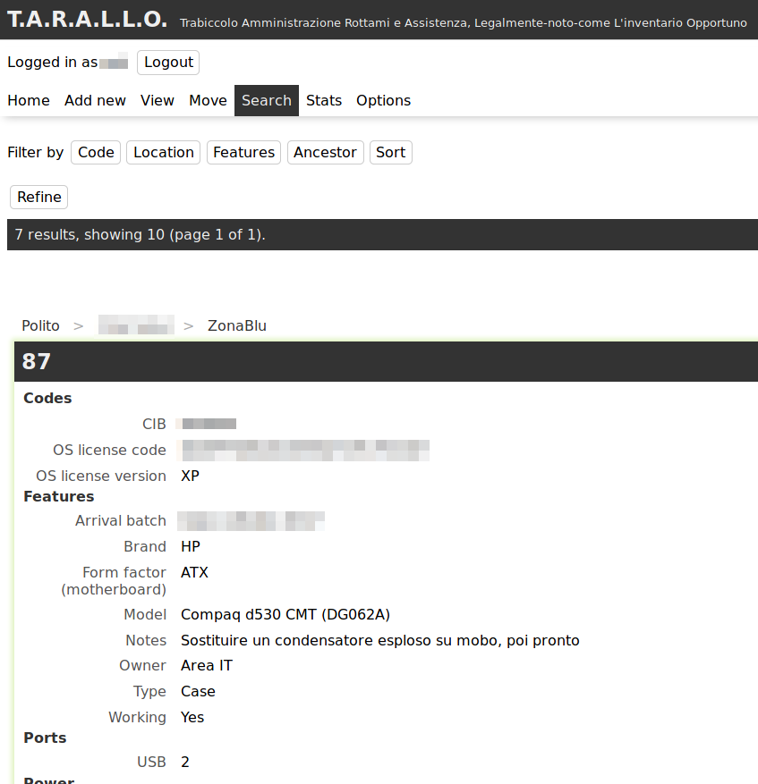

Nel corso dell'ultimo anno ho progettato, realizzato e rifinito [il software](https://github.com/WEEE-Open/tarallo) che utilizziamo per fare l'inventario di tutti i computer e componenti che ci passano per le mani in laboratorio.

Il 12 aprile 2018 tale software ha finalmente raggiunto uno stato sufficientemente stabile da poterlo utilizzare ed è stato ufficialmente rilasciato all'interno del team. Da quel giorno è obbligatorio usare quello invece del vecchio inventario.



Le motivazioni di un simile progetto sono semplici: sapere cosa c'è in laboratorio, in che condizioni è, cosa è stato riparato, cosa no, cosa si può riparare e così via.

Può essere interessante analizzare alcuni aspetti di questo progetto.

## Situazione di partenza

### Software preesistente

Esistono già altri software che svolgono compiti simili, principalmente CMDB (configuration management database) e PIM (Product information management). Tuttavia, tra questi non ne avevo trovato alcuno open source e che facesse al caso nostro.

I CMDB sono fatti apposta per inventariare un gran numero di apparecchiature informatiche, e spesso anche di altri "oggetti" (documentazione, software, persone in quanto assegnatari del computer o addetti alla manutenzione di un server, etc...), ma non sono abbastanza granulari: possono ad esempio tenere traccia del fatto che "nell'ufficio ci sono 50 computer modello X con 2 GB di RAM e CPU dual-core e 100 modello Y con 4 GB di RAM e CPU quad-core" e a chi è stato assegnato ciascun computer e altre informazioni sulla configurazione. A noi invece servono informazioni più granulari sull'hardware, ad esempio: quanti moduli di RAM, di che dimensione, frequenza, form factor e standard ci sono in ogni singolo computer?

Questo perché per riparare computer spesso spostiamo componenti da uno all'altro: sarebbe utile sapere subito dall'inventario che genere di moduli RAM si possono mettere in quel computer e in che posizione del laboratorio ne posso trovare alcuni, senza estrarre il computer dalla piramide di catorci che lo sovrasta e senza perlustrare tutti gli armadi. Lo stesso vale ovviamente per gli altri componenti. Anche supponendo di separare le RAM per tipo in scatole diverse in un armadio, cosa che effettivamente abbiamo fatto, fa comodo poter sapere quante ce ne sono di ogni tipo sia lì che nei computer senza contarle a mano.

Inoltre è estremamente importante sapere in che condizione sono i computer nel mucchio di quelli da riparare: che componenti hanno, che componenti servono, se abbiamo già identificato il guasto o no, quali prove sono state fatte, etc... potremmo sempre annotare tutto questo nelle note, che diventerebbero un campo enorme e illeggibile.

I PIM, su cui ho indagato meno, in realtà credo che siano ancora meno adatti: sono utilizzati dai negozi on-line per memorizzare informazioni sui prodotti, quindi si possono inserire tutte le specifiche tecniche del computer modello X, e poi al massimo memorizzare quanti ce ne sono in magazzino (cosa che in realtà è compito di altri software che si interfacciano al PIM). Questo per noi non ha senso visto che produciamo molti computer "Frankenstein" con pezzi presi di qua e di là.

### L'inventario inoppotuno

Va ricordato anche che l'idea non è nata dal nulla sulla base di elucubrazioni fini a sé stesse, ma dalla volontà di sostituire il documento di LibreOffice Calc che utilizzavamo come inventario con qualcosa di più comodo e funzionale.

Il documento, con molta fantasia chiamato `inventario.ods`, è nato come un foglio molto semplice: per ogni riga un computer, sulle colonne il codice (sia quello di inventario del Politecnico, che dobbiamo annotare in quanto serve a scaricare dall'inventario il bene prima della donazione, sia un codice assegnato da noi) e una descrizione dei componenti: RAM totale, quanti HDD da quanto, se c'era l'alimentatore o no, etc... e ogni cella era colorata in verde, giallo, rosso o bianco per distinguere componenti funzionanti, riparabili o forse guasti, sicuramente guasti e da provare, rispettivamente.

Al fondo di ogni riga, vicino alla posizione del computer, c'era un campo "note" per annotare le prove effettuate e altre considerazioni.

Questo metodo non è certo "scalabile": innanzitutto *solo una persona per volta può modificare l'inventario da un solo computer per volta*, con l'ovvia conseguenza che spesso era più facile spostare roba in giro senza aggiornarlo. L'inventario però ha valore fintanto che corrisponde alla realtà.  
Inoltre *il campo "note"*, per quanto sempre necessario, è ovviamente diventato in breve tempo *enorme e illeggibile* e nessuno lo considerava da talmente era difficile trovare le informazioni là dentro.

Ne consegue che spesso non era aggiornato o ridondante o che le informazioni risiedevano solo nella testa di alcuni:  
«Dov'è il PC 32?»  
«Laggiù, perché lo cerchi?»  
«È tutto segnato in verde tranne la RAM, provo a cambiarla»  
«Ah, ma è quello che ho provato a riparare la settimana scorsa! La RAM l'ho tolta e mi sono dimenticato di aggiornare l'inventario, ma probabilmente si è bruciato l'alimentatore»  
«Nel campo note dice che manca l'alimentatore, ma di fianco c'è scritto che c'è...»  
«Si vede che qualcuno l'ha tolto ma non ha aggiornato il campo»

Oltre a questo, con una singola scheda, non era veramente possibile seguire dettagliatamente lo spostamento dei componenti: all'inizio veniva annotato nel campo note, aumentando il caos generale, poi abbiamo creato una scheda "movimenti" con 4 colonne: oggetto, spostato da, spostato in, data. C'erano identificatori del tipo "RAM del PC 15", che però dopo due spostamenti non avevano più senso: se quel modulo di RAM passava dal PC 15 al 21 e poi 37, bisognava ricostruire ogni volta la sua storia pregressa per capire che si chiama "RAM del PC 15" e non era "nato" nel 21.

Per questo, dopo circa 10 righe inserite in quella scheda, abbiamo iniziato a inventariare singolarmente tutti i componenti: abbiamo aggiunto altre schede, una per le RAM, una per gli HDD, etc.. e assegnato a ciascun componente un codice univoco, oltre ad annotare le caratteristiche rilevanti e il seriale, se per caso c'era stampato sopra, non potendo attaccare un'etichetta a ogni singolo modulo di RAM.

Questo ha richiesto di riaprire tutti i computer, vedere esattamente che componenti c'erano dentro, inventariarli singolarmente e annotarne solo il codice nella scheda "computer": per sistemare i circa 30 computer che avevamo inventariato prima di passare a questo metodo c'è voluto oltre un anno.

Un enorme svantaggio di questo metodo, oltre alla lentezza nell'inserire tutti i dati, era il livello di indirezione aggiuntivo: guardando il computer 25 si poteva apprezzare il fatto che contesse RAM180, RAM181 e HDD43, *senza altre informazioni su quali componenti fossero*: era necessario verificarlo nelle altre schede. Abbiamo lasciato la cella colorata in verde/giallo/rosso/bianco anche nella scheda computer per avere almeno un'indicazione a colpo d'occhio su quali fossero i computer messi meglio e quali peggio, ma ogni cambio di colore andava quindi effettuato in due posti: anche nella scheda specifica per quel componente c'era l'apposito colore di sfondo.

Il problema del livello di indirezione era però ancor più insidioso: *ogni spostamento richiedeva di essere indicato in 3 posizioni diverse*, cioè nella scheda "computer", in quella del componente in quanto ognuno aveva una colonna per la posizione anche lì (molti componenti sono in qualche armadio e non un computer) e nella scheda "movimenti". Il risultato ovvio era che spesso qualcuno si dimenticasse un pezzo o decidesse di non annotarlo e basta perché costava troppa fatica farlo.

## Situazione a cui tendere

Considerato ciò, alcune delle specifiche fondamentali per il nuovo software erano queste:

* Quando si visualizza un computer, bisogna vedere immediatamente anche tutti i componenti che si trovano all'interno
* L'inventario dev'essere accessibile da più persone simultaneamente, devono anche poter fare modifiche in simultanea, ma non allo stesso oggetto ovviamente
* Ridurre il campo note senza aggiungere migliaia di colonne che spesso resterebbero vuote: di ogni oggetto si devono vedere solo le caratteristiche che sono state memorizzate, ma se ne possono aggiungere altre senza particolari limitazioni
* Tenere traccia di chi ha fatto modifiche o spostamenti agli oggetti (con nome utente, data e ora)
* Spostare gli oggetti facilmente, eventualmente senza cercarli: se estraggo HDD129 da un computer e lo metto in un armadio, so il codice del disco perché c'è scritto sopra e quello dell'armadio, oltre a quello del computer che però non serve perché era la precedente posizione del disco, quindi sarebbe comodo annotare lo spostamento senza dover prima cercare il componente
* Strumenti di ricerca raffinati: devo poter trovare "tutte le RAM DDR2 funzionanti all'interno di un computer rotto che sia in laboratorio e non in magazzino", sul foglio di calcolo è impensabile fare ricerche simili

Ce n'erano anche altri, come "calcolare in automatico se il computer funziona o no in base al funzionamento di tutti i componenti all'interno", non implementata perché di utilità ridotta e difficile da realizzare, e gli "oggetti di default", solo parzialmente implementati e sui cui tornerò più avanti, o il versionamento delle porte: un oggetto può avere una porta SATA I, ma se cerco tutti quelli che hanno una porta SATA II, essendo standard retrocompatibili, devo trovare anche quelli con una SATA I, feature scartata in quanto oltremodo complessa da realizzare.

I vincoli sulle tecnologie da utilizzare tuttavia erano relativamente stringenti: il software, che deve essere di tipo client-server perché è il modo più facile per consentire l'accesso simultaneo agli utenti, deve girare sul server su cui si trova il nostro sito. Il server è quello delle pagine web personali dei docenti, gestito dall'Area IT: le tecnologie da utilizzare sono quindi PHP 5.6 e MariaDB, in quanto ci sono solo quelli installati sul server.

Utilizzare un database NoSQL e PHP 7 probabilmente avrebbe semplificato notevolmente il lavoro, ma si fa quello che si può.

## Edificare il software

In un impeto di modernità, ho pensato di realizzare il client interamente in JS con rendering client-side, e ridurre il server a un'API JSON, sebbene non particolarmente RESTful, priva di qualsivoglia interfaccia grafica.

Non è tanto assurdo realizzare quello che alla fine è un programma più che un sito con JS e rendering esclusivamente client-side, ma dopo un anno di lavoro [inizio a dubitare che fosse una buona strategia](https://tomdale.net/2015/02/youre-missing-the-point-of-server-side-rendered-javascript-apps/).

In ogni caso ho cominciato col server, in quanto più facile: secondo le best practice bisognerebbe partire dall'interfaccia, per poi costruire il "motore" di conseguenza, ma l'interfaccia del server è l'API, quindi non credo che ci fosse nulla di inerentemente sbagliato in questa scelta.

### Il database

Visto che all'inizio i requisiti erano ancora troppo fumosi e non sapevo bene che forma avrebbe assunto il client, ho deciso di partire con il database e adottare le metodologie di progetto che ci vengono insegnate nel corso di Basi di dati. Probabilmente sono una semplificazione "eccessiva" di quello che è il mondo reale, ma un database l'ho progettato.

Non sto a riportare il diagramma entity-relationship (ER) originale in quanto molte cose sono cambiate in corso d'opera, ma la [struttura attuale del database](https://github.com/WEEE-Open/tarallo-backend/blob/master/database.sql) è visibile a chiunque, essendo il T.A.R.A.L.L.O. open source.

Tuttavia, già dal diagramma ER sono subito emersi alcuni dettagli che non mi erano per nulla evidenti:

- Gli oggetti di default/prodotti sono distinti dagli oggetti "esistenti nel mondo reale"
- Marca e modello devono essere colonne nella tabella degli oggetti, non righe nella tabella delle feature
- Per tenere traccia degli spostamenti, basta memorizzare per ogni oggetto chi l'ha spostato quando e dove, invece di copiare tutta la riga in un'altra tabella o nella stessa ma con un altro numero di revisione: bisogna solo creare una audit table, in pratica

#### Struttura ad albero

Una delle prime scelte significative è stata quella di come rappresentare la struttura ad albero degli oggetti. [Esistono varie tecniche](https://stackoverflow.com/q/4048151), tutte con [vantaggi e svantaggi](https://www.slideshare.net/billkarwin/models-for-hierarchical-data):

- *"Puntatore" al "parent"* in ogni oggetto: è semplice da realizzare, ma richiede molte query per trovare il percorso completo degli oggetti. C'è `WITH RECURSIVE SELECT`, che al momento del progetto era stato aggiunto da circa 1 mese a MySQL e MariaDB, su versioni che vedremo sul server tra qualche migliaio di anni se va bene.
- *Path enumeration*: in ogni oggetto scrivere il percorso. Può essere comodo per una facile conversione da URL a query, ma rende più complesso cercare gli oggetti in base alla posizione.
- *[Nested Sets](https://en.wikipedia.org/wiki/Nested_set_model)*: non saprei come descriverli sitenticamente. Spostamento e inserimento non sono tremendamente efficienti, ma si riescono a fare con una query unica quindi probabilmente nel mondo reale è più veloce che lanciare decine di query come col puntatore al parent senza `WITH RECURSIVE SELECT`.
- Closure Table: crea una nuova tabella con tutte le coppie antenato/discendente (a ogni livello). Complessità di spazio O(n²), con gli indici non dovrebbe essere troppo tragico fare query là sopra.

Riassumendo il confronto da quelle e [altre slide](http://www.slideshare.net/billkarwin/sql-antipatterns-strike-back/49-Naive_Trees_Objective_storequery_hierarchical) sempre di Bill Karwin, ho dedotto che le varie tecniche hanno questi vantaggi e svantaggi rispetto alle varie operazioni:

| Tecnica          | Trova discendenti | Trova posizione | Spostamento | Inserimento | Integrità referenziale |
| ---------------- | ----------------- | --------------- | ----------- | ----------- | ---------------------- |
| Puntatore parent | Difficile         | Difficile       | Facile      | Facile      | Sì                     |
| Path enumeration | Facile            | Facile          | Difficile   | Facile      | No                     |
| Nested Sets      | Facile            | Difficile       | Discutibile | Discutibile | Ni                     |
| Closure table    | "Facile"          | "Facile"        | "Difficile" | "Difficile" | Sì                     |

Volendo privilegiare la velocità in lettura rispetto alla scrittura, la scelta era sostanzialmente tra path enumeration e closure table. Visto che gli oggetti sono sì tanti ma non una quantità sterminata e visto che mantenere l'integrità referenziale fa sempre comodo, ho optato per implementare una closure table.

Devo dire che questa scelta si è rivelata ottimale nel nostro caso: la tabella, come ho visto in seguito, ha dimensioni molto contenute e ben minori dall'O(n²) teorico, le query sono abbastanza facili da scrivere e ragionevolmente veloci da eseguire.

#### Caratteristiche degli oggetti

Gli oggetti possiedono delle caratteristiche. Una delle affermazioni più generica che si possa fare, ma è così: oltre a marca e modello e proprietario e codici di inventario vari e il funziona/non funziona, le CPU hanno una frequenza e un numero di core, le schede grafiche una quantità di VRAM e delle porte a cui collegare lo schermo, le schede madri hanno un gran numero di porte e socket (inclusi quelli della RAM e della CPU), e così via.

In pratica ho fatto la descrizione di un [Entity-Attribute-Value (EAV)](https://en.wikipedia.org/wiki/Entity%E2%80%93attribute%E2%80%93value_model), modello che in genere è da evitare sui database relazionali, salvo alcuni casi particolari: grande quantità di attributi/caratteristiche, possibilità che qualunque entità/oggetto assuma qualunque caratteristica ma non le assuma quasi mai tutte (o quasi tutte), etc... ed era sostanzialmente il nostro caso.

Dopo molti tentativi ed esperimenti compiuti nel corso dei mesi, l'assetto finale raggiunto al momento della scrittura di questo documento è di avere quattro tipi di caratteristiche, in base ai possibili valori:

- Numeri interi positivi
- Numeri reali positivi
- Campi di testo libero
- "Enum", valore scelto da un insieme limitato (che dipende dalla caratteristica)

La distinzione su quale usare tra interi e reali è abbastanza arbitraria, anche perché i reali sono stati aggiunti in seguito: la tensione degli alimentatori dei portatili, espresse in volt, sono memorizzate come reali, mentre la frequenza delle CPU e delle RAM, espressa in hertz, è memorizzata come intero. In entrambi i casi, se fossero numeri troppo grandi, l'interfaccia grafica li converte automaticamente in multipli, e.g. visualizza "3.2 GHz".

I campi di testo libero sono utilizzati per le note, per i codici di inventario del Politecnico e per poco latro. Gli enum sono utilizzati ad esempio per i socket delle CPU o per lo standard delle RAM (DDR, DDR2, DDR3, etc...).

Generalmente, quando si realizza un EAV, i valori vengono memorizzati nella stessa colonna e poi, una volta capito che genere di valore c'è per quell'attributo, si effettua un cast. Nel nostro caso ogni attributo/caratteristica ha il suo tipo di valore associato, sia nel database che in un file .php del server (una sorta di cache), ma non è necessario alcun cast: ogni riga con una caratteristica ha 4 colonne in base ai 4 tipi di valori, tre delle quali sono NULL.

Non ho statistiche precise a riguardo non avendo mai provato il metodo dei cast, ma credo che sia stata una scelta accettabile: lo spazio occupato non sembra risentirne particolarmente e le query sono decisamente facili da scrivere.

##### Proprietà duplicate

Alcuni oggetti possono avere due etichette di inventario del Politecnico, o una scheda video può avere due porte VGA: come si procede in questi casi? La chiave primaria della tabella, che identifica completamente e univocamente la riga e quindi non può essere duplicata, è la coppia oggetto-caratteristica.

Anche qui, ho dovuto valutare varie vie:

- Cambiare chiave primaria utilizzando un ID autoincrementante. Facile da implementare, ma permette di inserire informazioni duplicate in maniera anarchica e sconnessa, complica le operazioni di aggiornamento e richiede di maneggiare l'ID sul server e sul client aumentando la complessità
- Estendere la chiave primaria anche al valore. Nuovamente permette di inserire informazioni duplicate (Frequenza: 3 GHz, Frequenza: 2.8 GHz, Frequenza: 1 Hz, Frequenza 42 MHz, etc...) e complica gli aggiornamenti.
- Aggiungere un campo "molteplicità": serve se una scheda grafica ha 2 porte VGA ma non risolve il problema per le caratteristiche testuali e in ogni caso richiede modifiche al server e al client.
- Ragionare in modo diverso sulle caratteristiche: "numero di porte VGA" e valore intero, invece che "ha una o più porte VGA". Non richiede nessuna modifica al server ma nuovamente non risolve il problema per le caratteristiche testuali.

Alla fine ho implementato l'ultima solo per semplicità, visto che nessun'altra delle scelte mi convinceva particolarmente. Quanto ai codici di inventario multipli, li memorizziamo tutti nello stesso campo separandoli con una virgola, tanto alla fine quelli sono campi di testo libero.

### Protocollo di comunicazione client-server

Una volta definito il database, è stato necessario definire un protocollo per far arrivare quelle informazioni al client, in quanto tale protocollo è l'altra interfaccia del server (l'altra è il database).

A parte l'ovvia scelta di usare JSON in quanto non esiste (più) alcuna alternativa, come devono essere strutturati i dati? Esistono molti standard, e molta gente che consiglia di non seguire alcuno standard.

Su internet ho sentito consigliare o nominare questi:

- [JSON API specification](http://jsonapi.org/): molto standardizzata, c'è un'abbondanza di librerie per creare e leggere i messaggi, comprensibile ma poco flessibile: forse non è la cosa migliore per rappresentare informazioni disposte ad albero, come praticamente tutte quelle che dovranno essere scambiate 
- JSend: minimalista, estremamente minimalista. È praticamente come non usare alcuno standard, definisce solo un modo per comunicare gli errori o il successo dell'operazione, ma non impone alcuna struttura ai dati
- RAML: è un linguaggio di descrizione delle API RESTful. Il server è configurato in maniera ignota e non abbiamo controllo su di esso ed è già tanto se riusciremo a impostare il MIME type giusto, sarebbe bello ma ho lasciato perdere subito
- OData: da quello che ho capito è uno standard poco usato in quanto soppiantato da JSON API
- JSON-LD: mi sembra che risolva un altro problema, quello di organizzare e strutturare dati provenienti da sorgenti diverse: sarebbe bello, ma iniziamo a collegare client e server prima di pensare a come interagiranno con altre sorgenti di dati

Arrivato a questo punto nella ricerca, ho deciso di utilizzare JSend. JSON sembra fatto apposta per memorizzare dati organizzati ad albero, tanto vale usarlo senza altri complicati standard: sicuramente sono utili in altre circostanze (e.g. dati disposti come grafi), ma nella nostra no. JSend mi consente comunque di non fare proprio tutto da zero, ma almeno dare una forma standard ai messaggi d'errore, rendendo tutta l'API più uniforme.

Inizialmente, non sapendo com'era configurato il server, non sapevo cosa sarebbe successo con richieste PUT o PATCH o DELETE, o se avremmo potuto usare mod_rewrite, quindi ho implementato tutto solo con richieste POST e GET, ad esempio. Alla fine ho risolto in maniera drastica questo problema e reso l'API un po' più moderna utilizzando anche PUT, PATCH e DELETE, ma ci tornerò dopo.

All'inizio avevo inoltre pensato di utilizzare un parametro per scegliere la lingua di eventuali stringhe traducibili presenti nelle risposte del server, ma ho ben presto abbandonato l'idea in favore di usare stringhe generiche e non mostrabili direttamente all'utente, ad esempio la caratteristica contenente il numero di porte SATA si chiama "sata-ports-n" e in tutti i messaggi JSON c'è sempre scritto quello, mai "Number of SATA ports".  
Probabilmente è un'ovvietà e credo che sia anche l'approccio più comune, infatti il design del server è diventato molto più semplice e lineare: il database e l'API non conoscono nemmeno l'esistenza delle traduzioni, comunicando soltanto nella lingua franca dell'inglese lowercase con trattini al posto degli spazi.

### Account e autenticazione

A ogni utente deve essere assegnato un account. Si fa il login con username e password. È la cosa più semplice da realizzare e il software dev'essere accessibile anche dall'esterno: `inventario.ods` è in una cartella condivisa di OwnCloud, quindi è accessibile anche quando il Politecnico è chiuso, il nuovo inventario deve mantenere tale caratteristica.

Ora c'è il progetto di integrare il login con LDAP in modo da ridurre il proliferare di credenziali, ma nell'immediato username e password vanno bene.

Il problema è come autenticare le richieste all'API:

- HTTP Basic? Username e password in ogni query rallenterebbero tutto con la necessità di calcolare l'hash ogni volta
- OAuth2? È complicato da implementare e serve più che altro a consentire l'accesso di terze parti a un account centralizzato, o alle terze parti da un account centralizzato
- JSON Web Token? È simile a OAuth2, concettualmente
- HMAC implementato a mano? No, esistono già una grande quantità di ruote rotonde di finissima fattura, inutile reinventare la ruota quadrata
- Cookie "remember me"? Consente di gestire più sessioni in parallelo, cosa per noi inutile
- Sessioni PHP? Un metodo considerato vecchio e superato da chiunque

OAuth2 e metodi simili hanno il vantaggio di essere infinitamente scalabili orizzontalmente. Tuttavia, l'API sostanzialmente fa da interfaccia al database, che non è infinitamente scalabile in orizzontale, negando uno dei principali vantaggi di questo sistema di autenticazione.

Alla fine ho implementato la vecchia, trita e ritrita sessione con stringa casuale nei cookie, memorizzata anche nel database.

Ovviamente tutto questo non può girare su HTTP senza TLS, qualunque metodo avessi implementato: purtroppo il server dell'Area IT non supporta HTTPS, al momento della scrittura di questo documento. I certificati costano e Let's Encrypt non è abbastanza professionale (anche se altri server sparsi per il dominio polito.it lo usano), immagino. La "soluzione drastica" di cui parlavo poco sopra ha risolto anche questo problema, ma ci tornerò dopo.

### Documentazione

Tutte queste scelte implementative e confronti tra alternative li ho anche scritti in un documento (un pdf di 25 pagine A4 con testo 12 pt), da cui in parte ho attinto per scrivere questo articolo. Non sto a riportarlo interamente perché ho cambiato in corso d'opera una quantità non trascurabile di decisioni che avevo preso all'inizio.

Per mesi ho comunque tenuto aggiornata la specifica, annotando tutte le variazioni in corso d'opera. L'utilità principale di tale documento era ripercorrere il ragionamento che mi aveva portato a certe scelte, piuttosto che fornire una descrizione di tutto ciò che è stato implementato.

In effetti mi è capitato di chiedermi «Perché ho implementato X in questo modo? Ce n'era un altro più semplice!», consultare la specifica e rispondermi «Ah, già, perché se lo facevo in quell'altro modo complicavo notevolmente l'implementazione di Y, allora ha senso!», quindi a qualcosa è servita, anche se probabilmente non è proprio corretto definirla una specifica. Verso la fine invece ho smesso di aggiornarlo, tanto le scelte più significative erano ormai fatte e a nessun altro nel team interessavano i dettagli di cosa stessi facendo.

A compensare la mancanza di una dettagliata descrizione di tutto ciò che è stato implementato e come, sopperiscono in parte i commenti alle funzioni e i test automatizzati.

I test sono stati probabilmente la "documentazione" più utile: mi hanno permesso più e più volte di trovare all'istante dei bug che altrimenti avrebbero richiesto ore di debugging, o di rendermi immediatamente conto se con qualche modifica avevo rotto tutto. Spero che la presenza di test, sebbene non siano stati progettati in maniera particolarmente formale e non coprano ogni possibile percorso nel codice, possano aiutare chi mi succederà nella manutenzione di questo software a riuscire a sistemare bug e aggiungere feature più facilmente che dire «Rifacciamo tutto da capo».

Sebbene l'importanza dei test sia generalmente riconosciuta da chiunque, anche al punto di arrivare a dire che il ["legacy code" è "codice senza test"](https://hackerboss.com/legacy-code/), la documentazione delle funzioni in generale non è ritenuta così importante come invece l'ho trovata. Non parlo dei "commenti" PHPDoc/JSDoc, praticamente indispensabili e che ho aggiunto a quasi tutte le funzioni: parlo della sintetica descrizione di cosa fa ogni funzione.

Si potrebbe obiettare che se le funzioni sono sufficientemente brevi e con un nome chiaro sia immediatamente ovvio cosa fanno, ma mi è capitato più volte di ritrovare una funzione che secondo la descrizione doveva fare una cosa, ma a furia di modificare il codice non riusciva più a farla, specialmente nella parte JS del client. Mi sono quindi sforzato di scrivere una descrizione subito dopo aver completato ogni funzione e credo che questo abbia ridotto in maniera sensibile il tempo passato a inseguire bug insidiosi, ma è possibile che progettare meglio in partenza il client avrebbe ridotto il tempo parimenti.

## Scelte che non hanno funzionato e come sono state corrette

Finora mi sono concentrato sulle scelte che ritengo abbastanza riuscite. Oltre a una miriade di altre su cui non c'è molto da dire, ce ne sono alcune che per quanto sembrassero ragionevoli hanno finito soltanto con l'ostacolarmi e se potessi tornare indietro avrei cambiato immediatamente.

Non che sia successo nulla di irreparabile visto che le ho cambiate strada facendo, ma mi sembra interessante menzionare quali sono state, perché non hanno funzionato e cosa ho cambiato.

### Troppe chiavi surrogate

Non avendo alcuna esperienza nella conversione dal modello concettuale a quello logico, a parte la teoria studiata nel corso di Basi di dati, ho chiesto consiglio a un collega più esperto di me in fatto di database relazionali e dopo una lunga discussione mi ha convinto che ogni oggetto deve avere una chiave primaria che è un integer autoincrementante, e così ogni caratteristica, invece di usare direttamente il nostro codice per l'oggetto e il nome per le caratteristiche.

Le motivazioni che mi ha indicato erano principlamente ridurre le dimensioni della closure table e della tabella che associa oggetti e feature, oltre a non fare chiavi primarie gigantesche. L'uso di chiavi surrogate di questo genere, soprattutto quando l'alternativa (business key) è una stringa, ha molti sostenitori:

* Spesso ha performance migliori, soprattutto su MySQL/MariaDB se confrontata a stringhe UTF-8 con collation Unicode
* Occupa meno spazio
* Consente di cambiare gli altri codici senza modificare tutte le tabelle: nel mondo reale i codici che sembrano immutabili hanno la tendenza a cambiare comunque e nei momenti meno opportuni

Tuttavia non c'è una risposta unica al problema e infatti questa strategia ha anche qualche detrattore, che fa notare che:

* Richiede praticamente sempre qualche join per ricostruire le informazioni
* Si possono ancora modificare i codici, ci pensa `ON UPDATE CASCADE` a mantenere l'integrità referenziale
* *Q:Why did we invent databases? A:to remove redundancy and later to ensure data integrity*, [dice Joe Celko in un thread](https://social.msdn.microsoft.com/Forums/sqlserver/en-US/fd7685b1-701e-49c8-8087-888857afb741/using-varchar-for-primary-key-value-ok#a1641c3e-e3b8-4ce2-8345-821e1f721f67)

I codici degli oggetti assegnati da noi sono in generale brevi, composti di solito da 4-5 caratteri; alcuni codici assegnati a mano sono più lunghi, ma sono circa lo 0.1% del totale: non contano nulla.  
In passato è stato necessario cambiarne alcuni, ad esempio per un po' abbiamo assegnato a tutti gli schermi il prefisso M per Monitor e poi siamo passati a V per Video in modo da liberare M per i mouse: questo ha richiesto di ri-etichettare tutti gli schermi, che erano comunque pochi, circa 10. Tale esperienza ci frena dal fare cambi di nome più significativi: ad esempio i lettori CD sono prefissati con ODD (Optical Disk Drive), troppo lungo e soggetto a confusione tra O e 0, ma rinominarli tutti, oltre un centinaio, è improponibile: bisognerebbe prenderli uno a uno e sostituire tutti i codici, che spesso abbiamo scritto con un pennarello indelebile per risparmiare etichette.

Anche se in futuro dovessimo cambiare i codici, comunque, sarà un'operazione altamente manuale, che quindi si può fare tramite alcune query scritte "on the fly" ed eventualmente mettendo il database offline per i 10 minuti necessari, non sarà mai qualcosa che il server potrà effettuare programmaticamente a suo piacimento.

Una volta iniziato il caricamento dei dati reali nel database, è diventato evidente che la complessità di scrivere tutte quelle query piene di join è stata abbastanza inutile, in quanto c'erano circa:

* 1200 righe nella tabella oggetti (82 + 145 KB)
* 10600 righe nella tabella che associa caratteristiche ad oggetti, `ItemFeature` (1.6 + 1.4 MB)
* 5600 righe nella closure table, `Tree` (344 + 180 KB)

Le dimensioni sono quelle della tabella stessa e poi degli indici. Nel caso degli oggetti, l'indice è sul nostro codice: spesso cerchiamo gli oggetti per codice quindi è un `INDEX`, e soprattutto devono essere unici quindi è anche `UNIQUE`. Insomma, quella colonna ha tutte le caratteristiche di `PRIMARY KEY`, che invece è un indice numerico autoincrementante invisibile all'utente finale.

Si deduce inoltre che ci sono circa 9 caratteristiche per oggetto, quando di uniche ce ne sono di solito 4: codice di inventario del Politecnico, "funziona/non funziona", seriale e note.

Tutte le altre sono marca, modello e caratteristiche di quel modello ripetute più e più volte, e non avevamo ancora inserito tutte quelle che si potrebbero inserire! L'uso dei "prodotti" ("oggetti di default") risolverebbe questo problema: se abbiamo 10 schede madri della stessa marca e modello, ci interessa solo sapere quale funziona e quale no. Se sono tutte identiche non mi interessa sapere che proprio *quella* ha 4 slot PCI: anche le altre li avranno e se sono diversi è probabilmente un errore di inserimento dei dati. Ciò potrebbe ridurre il numero di righe di un ordine di grandezza.

Implementare i prodotti, in quello stato, era possibile ma avrebbe richiesto di spazzare sotto al tappeto una montagna di debito tecnico e crearne altro: il codice che recupera gli oggetti dal database era enorme ed eccessivamente complicato.

La lettura degli oggetti infatti avviene in due parti: prima vengono recuperati gli oggetti dall'albero in base a vari criteri di ricerca (che possono anche essere semplicemente "ha codice = XYZ"), poi con una query separata si ottengono le caratteristiche di ogni oggetto. Questo ha richiesto di far uscire le chiavi surrogate dal database e farle atterrare sul server, per evitare altre join: il codice risultante quindi passava qua e là array associativi con chiavi improbabili e ho l'impressione che stesse in piedi con gli stuzzicadenti, anche se c'erano vari test che passavano tutti e quelle funzioni avevano una buona copertura, quindi forse non avevo fatto un lavoro così terribile alla fine.

In ogni caso non potevo lasciare il codice in quelle condizioni: ho deciso di ripulirlo e suddividerlo meglio, ovvero separare le funzioni di ricerca da quelle per la lettura di un singolo oggetto, che si trovavano nello stesso file ed erano strettamente collegate mentre ora fanno parte di classi diverse.

Nel contempo ho sostituito tutte le chiavi surrogate con le business key di tipo `varchar`: per gli oggetti il codice assegnato da noi, per le caratteristiche la stringa lowercase con trattini che ne indica univocamente il nome. Questo ha permesso di rimuovere una buona quantità di codice dal server e in generale rimuovere codice lasciando invariate le funzionalità è un fatto molto positivo.

Fare una query unica (albero + caratteristiche) era improponibile, mentre recuperare tutte le caratteristiche con una singola query invece di farne una per oggetto era più ragionevole: avevo effettivamente implementato tale funzione, ma il codice era troppo complesso da comprendere ed estendere, quindi alla fine ho di nuovo usato la stessa query ripetuta per i diversi oggetti, tramite un prepared statement.

Le dimensioni delle tabelle sono cambiate così:

- Tabella oggetti: 82 + 65 KB
- Tabella che associa caratteristiche ad oggetti: 1.6 + 1.4 MB
- Closure table: 230 + 360 KB

Addirittura, la dimensione degli indici nella tabella degli oggetti si è ridotta: in effetti prima c'era la `PRIMARY KEY` e poi due indici `UNIQUE` e `INDEX` sulla colonna con il nostro codice, ora c'è solo la `PRIMARY KEY`. L'intero database è diventato più piccolo: ovvio perché ci sono meno colonne, un po' meno ovvio perché ci sono più varchar in ogni riga; la closure table da circa 6000 righe prima conteneva due interi per riga, ora due varchar, ma le dimensioni non sono cambiate significativamente.

Vale la pena aggiungere che le caratteristiche di tipo "enum" hanno una stringa che indica il valore. Tutte le stringhe possibili per quella caratteristiche stanno in un'apposita tabella e prima avevano un indice intero. Nell'impeto di rimozione delle chiavi surrogate ho inserito direttamente la stringa col valore nella tabella che associa caratteristiche ad oggetti e anche quella praticamente non ha cambiato dimensione.

Le query dotate di join sono diventate leggermente più lente, ne ho provata qualcuna e ci mettono circa 30 ms vs 10 ms di prima, quindi nulla di tragico: il risvolto della medaglia è che tutte le query sono diventate più facili da scrivere, quindi è molto più comodo sia "analizzare" i dati con query ad hoc sia estendere il software in vari modi, e a volte non sono nemmeno più necessarie join che prima lo erano.

#### Accorpamento della gerarchia degli oggetti nel padre

Cioè considerare oggetti normali e di default (prodotti) alla pari, distinti solo dal campo `isDefault`. Questo consente di avere un'unica tabella per le caratteristiche con un'unica colonna che punta all'uno o all'altro, cosa che sembrava promettente ma si è rivelata assolutamente inutile perché troppo complicata da sfruttare nelle join.

Inoltre, era una buona distinzione in un'ottica di server monolitico, in quanto le classi `Item` e `ItemDefault` possono estendere l'una l'altra o estendere una classe base comune e si possono fare query con ambo i tipi di oggetti insieme, ma non in un'ottica di microservizi, dove sarebbe più opportuno avere un servizio per gli oggetti e uno per i product; cosa che rispecchia anche la divisione tra CMDB e PIM, visto che per alcuni aspetti questo software ricorda uno e per certi altri l'altro.

Il server alla fine è un monolito e non una raccolta di microservizi e resterà tale ancora per lungo tempo, ma i monoliti sono più difficili da gestire ed estendere e purtroppo me ne sono accorto. Ho quindi ho deciso di demolire quanto avevo fatto sugli oggetti di default e implementarli in maniera più distinta dagli *Item*, chiamandoli *Product*.

I vantaggi di gestione semplificata e facilità di estensione ci sono comunque, anche se il codice e la struttura dati è forse meno efficiente (ma non è nemmeno detto, non avendo sfruttato granché i vantaggi della precedente architettura), ma allo stato attuale sono l'unico nel team in grado di mettere mano a questo progetto: più che un software oltremodo efficiente, ce ne serve uno efficace, che faccia bene tutto quello che deve fare, anche se ci mette qualche millisecondo di troppo o gli indici occupano qualche kilobyte più del dovuto.

Inoltre, non posso lasciare a chiunque mi succederà nella manutezione di questo manufatto una palla di codice inestricabile dove appena si aggiunge una virgola esplode tutto: una delle qualità essenziali del codice, in un progetto a cui dovrà lavorare più di una persona, è che sia chiaro e comprensibile.

A meno che non si voglia diventare "indispensabili" all'azienda scrivendo codice intenzionalmente convoluto e oscurato, ma quello è un altro discorso.

#### Eccessiva flessibilità del protocollo di comunicazione client-server

Di per sé il protocollo non è complesso, anzi, è molto semplice e questo consente una certa flessibilità. Forse troppa. Probabilmente troppa. Sicuramente troppa. Consente di inviare al server varie modifiche in simultanea: inserimento, spostamento, modifica di singole caratteristiche, etc... tutte in una foresta di oggetti.

È facile da leggere sia per un essere umano che per un computer, permette di ridurre le richieste che volano verso il server, consente di implementare delle "transazioni" enormi: "inserisci questi oggetti, modifica quelli, sposta quegli altri" e queste operazioni devono riuscire tutte o nessuna.

Troppo tardi mi sono reso conto le transazioni enormi non servono a nulla. Se anche per ipotesi ci volesse qualche secondo a fare ogni operazione separatamente, è meglio farla immediatamente che inviare al server il malloppo solo alla fine, perché c'è il rischio che l'utente si dimentichi di farlo o che qualcun altro faccia modifiche in conflitto con quelle non ancora salvate.

La necessità di ridurre le richieste in volo era molto sentita perché per mesi siamo stati in laboratorio senza una connessione cablata, attaccati al wifi del corridoio con una tacca e a cui erano già collegati altri 500 studenti, quindi la connessione era a 10 kbit/s nei momenti migliori e andava e veniva.   Fortunatamente quell'epoca è finita, da tempo il laboratorio è stato cablato Ethernet.

In ogni caso sono anche riuscito a implementare questo meccanismo con successo; il server riordina, normalizza, esegue le operazioni nell'ordine corretto, ma ci sono svantaggi catastrofici che soverchiano completamente i vantaggi:

* Sul client bisogna mantenere uno strato di "overlay" con le modifiche e applicarlo ogni volta che si visualizza un oggetto modificato, richiedendolo quindi al server, ma le cui modifiche non sono ancora state inviate. Facile quando sono state cambiate le caratteristiche, un po' meno per spostamento ed eliminazione
* Ricostruire la foresta di oggetti modificati e inviarla al client è difficile, e farla vedere all'utente in maniera comprensibile è ancora più difficile
* La gestione di questo protocollo sul server è troppo intersecata e interconnessa, ci sono funzioni enormi che si richiamano a vicenda ed è troppo complicato fare modifiche e migliorie

Pertanto, nel passaggio da v0 a v1 dell'API, ho rimosso la possibilità di effettuare transazioni complesse. Ogni richiesta deve fare solo un'operazione e solo su un oggetto: inserimento, modifica, eliminazione.

L'inserimento in realtà può contenere un albero di oggetti, ma niente di più.

Questo ha consentito di semplificare notevolmente praticamente tutto il codice del server, rendendolo più ordinato e lineare, e migliorare la gestione delle transazioni SQL: prima c'erano vari punti in cui le transazioni potevano iniziare e terminare a seconda di che chiamata all'API era stata fatta (modifica, login, etc...) e non mi era ben chiaro dove posizionare queste operazioni e inoltre si erano manifestati dei bug in cui in alcuni percorsi c'erano due `BEGIN TRANSACTION` che causavano un errore, o il server generava la risposta senza fare `COMMIT` vanificando tutto.

Separando le varie operazioni di modifica su URL diversi e vedendo tutti i possibili endpoint dell'API uno di fianco all'altro ho avuto un'intuizione che ha semplificato notevolmente il codice, per quanto possa sembrare banale: `BEGIN TRANSACTION` prima ancora di interpretare quale endpoint è stato contattato, `COMMIT` subito prima di inviare la risposta, `ROLLBACK` in caso di eccezioni. Ogni chiamata all'API compie quindi un'operazione atomica sul database per quanto sia complessa, ma generalmente non sono molto complesse, e il codice che gestisce le transazioni si trova intorno a quello del router (FastRoute) invece di essere sparpagliato per le classi che accedono al database: la chiarezza del codice è aumentata in maniera impressionante.

### Implementare le funzionalità più semplici come casi particolari di quelle più complesse

In sostanza c'era un'unica, enorme funzione per cercare gli oggetti nel database, che assemblava una query gigantesca amichevolmente della "la megaquery". SQL dinamico generato da PHP con varie funzioni che mettono insieme i pezzi, il risultato tipico era qualcosa del genere, che trova gli oggetti cercando in base a una caratteristica che abbia un certo valore (è parametrizzata quindi c'è solo scritto `:searchname0` e `:searchvalue0`):

```
SELECT DescendantItem.`ItemID`, DescendantItem.`Code`, Tree.`Depth`,
MAX(IF(Parents.`Depth`=1, Parents.`AncestorID`, NULL)) AS Parent
FROM Tree
JOIN Item AS AncestorItem ON Tree.AncestorID = AncestorItem.ItemID
JOIN Item AS DescendantItem ON Tree.DescendantID = DescendantItem.ItemID
JOIN Tree AS Parents ON DescendantItem.ItemID = Parents.DescendantID
WHERE AncestorItem.isDefault = 0
AND Tree.`Depth` <= :depth
AND Tree.AncestorID IN (
  SELECT `ItemID`
  FROM Item
  WHERE (`Code` LIKE :code0) AND 
  ItemID IN (
    SELECT ItemID
    FROM Item
    WHERE IsDefault = 0
    AND (
      ItemID IN (SELECT Item.ItemID 
        FROM Item
        JOIN ItemFeature ON Item.ItemID = ItemFeature.ItemID
        JOIN Feature ON ItemFeature.FeatureID = Feature.FeatureID
        JOIN FeatureValue ON ItemFeature.FeatureID = FeatureValue.FeatureID
        WHERE ItemFeature.ValueEnum = FeatureValue.ValueEnum
        AND Feature.FeatureName = :searchname0
        AND Feature.FeatureType = 2
        AND FeatureValue.ValueText = :searchvalue0)
      OR
      Item.`Default` IN (SELECT Item.ItemID 
        FROM Item
        JOIN ItemFeature ON Item.ItemID = ItemFeature.ItemID
        JOIN Feature ON ItemFeature.FeatureID = Feature.FeatureID
        JOIN FeatureValue ON ItemFeature.FeatureID = FeatureValue.FeatureID
        WHERE ItemFeature.ValueEnum = FeatureValue.ValueEnum
        AND Feature.FeatureName = :searchdefaultname0
        AND Feature.FeatureType = 2
        AND FeatureValue.ValueText = :searchdefaultvalue0)
    )
  )

)
GROUP BY DescendantItem.`ItemID`, DescendantItem.`Code`, Tree.`Depth`
ORDER BY IFNULL(Tree.`Depth`, 0) ASC
```

Di per sé non credo che "implementare le funzionalità più semplici come casi particolari di quelle più complesse" sia sbagliato, ma in questo caso anche per recuperare un oggetto sapendo già il codice bisognava comunque invocare la funzione di ricerca, davvero troppo grossa e praticamente impossibile da comprendere e gestire.

Se dopo un mese avessi voluto implementare altri tipi di ricerca, oltre che per caratteristiche, codice, posizione e simili, avrei dovuto estenderla. Non ne sarei più stato in in grado. Non ne ero in grado: a un certo punto ho dovuto fare modifiche alla struttura generale della megaquery per sistemare un bug e non mi ricordavo minimamente come funzionasse, l'ho dovuta rileggere e cercare di capire un pezzo per volta, facendo varie prove per arrivare a ricordare l'utilità di alcuni passaggi.

Spostare complessità nel database ha una sua logica, in quanto consente all'ottimizzatore di trovare il piano di esecuzione più efficiente, cosa che facendo una serie di query e assemblando il risultato con PHP non può fare, ma probabilmente questo è eccessivo.

Ho quindi deciso di "demolirla": innanzitutto ho creato una funzione separata che recupera dal database il singolo oggetto (o meglio il singolo sottoalbero), più semplice e gestibile e sempre utile. Tale funzione usa una query per trovare tutti gli oggetti del sottoalbero, poi una per oggetto per recuperare l'elenco di caratteristiche e infine una per trovare l'elenco di antenati dell'oggetto radice ovvero la sua posizione: sono tre query di cui quella per le caratteristiche ripetuta per ogni oggetto invece che due, certo, ma non è un numero enorme.

Nel caso peggiore, in cui si cerca di visualizzare tutti i circa 1400 oggetti presenti nell'inventario richiedendo al server l'oggetto radice, ci ci vuole circa 1 secondo per interrogare il database, costruire la risposta, inviarla al client e aspettare che il browser la renderizzi. Tutto questo sul server di produzione posto su internet, quindi sicuramente anche la "lentezza" della rete contribuisce significativamente a quel tempo, che trovo perfettamente accettabile: non c'è nessun caso realistico in cui debbano essere visualizzati 1400 oggetti, al massimo 100 per pagina nei risultati di ricerca se i risultati sono computer che contengono a loro volta molti componenti, ma mediamente sono ancora meno.

Quanto alle funzionalità di ricerca, prima erano di tipo "stateless": ogni volta il client inviava al server l'elenco di parametri secondo cui cercare e che pagina di risultati visualizzare, il server eseguiva la megaquery e restituiva la pagina richiesta. Queste operazioni erano decisamente troppo lente, c'era un ritardo tangibile dal click sul link alla pagina successiva al caricamento della stessa.

Ho quindi deciso di scindere la ricerca in due fasi distinte: il client invia al server i filtri da applicare per trovare i risultati, il server esegue la ricerca e salva i codici degli oggetti in un'apposita tabella. In seguito il client richiede una certa pagina di quella ricerca e i risultati vengono presi da quella tabella.

Questo sistema è tangibilmente più veloce e risolve anche un altro inconveniente: in precedenza, se venivano modificati gli oggetti in modo da aggiungere/rimuovere risultati, il cambio di pagina poteva saltarne qualcuno o mostrarlo due volte se si spostava di pagina. Questo perché la paginazione era implementata con una semplice `LIMIT` invece di usare un [keyset](http://use-the-index-luke.com/no-offset), più complesso da implementare. Il nuovo metodo, che memorizza i risultati di ricerca e attinge da lì, risolve il problema usando comunque una semplice `LIMIT`.

Nuovamente, il codice è diventato molto più chiaro e comprensibile: ci ho messo 3 mesi a scrivere la megaquery e tutto il codice attorno per effettuare le ricerche ma era un groviglio inestricabile, mentre ci ho messo 1 mese a frantumarla in varie classi e funzioni molto più facili da comprendere.

### Client-side rendering

Questo è stato senza dubbio l'errore più grosso. Motivato dal fatto di voler fare qualcosa di moderno, di non voler usare troppo PHP, di non sapere bene come fosse configurato il server e quali incompatibilità strane avrei trovato, ho spostato quanta più logica possibile sul client.

Il client-side rendering in altre circostanze è lo strumento giusto, teoricamente anche qui poteva esserlo, in pratica non lo è stato. Il problema forse discende dal framework scelto: nessuno.

Inizialmente, dopo averne confrontati un po', per quanto possibile in tempi ragionevoli visto che ne esistono decine e decine, avevo deciso di usarne uno non troppo "opinionato" e che non fosse oltremodo complesso da apprendere. Backbone mi è sembrato la scelta giusta: sì, è uno dei più vecchi, ma è anche relativamente semplice e tuttora mantenuto; dopo la versione 1.0 gli sviluppatori hanno deciso di non aggiungere altre feature ma soltanto sistemare i bug e l'idea di poter utilizzare una libreria che avesse superato la prova del tempo era allettante.

Di solito l'idea allettante è utilizzare una libreria creata l'altro ieri, non una del 2010: tuttavia ci sono troppe librerie JS promettenti che, per quanto possano essere belle e innovative, svaniscono nell'oblio in breve tempo non riuscendo a prendere slancio e di conseguenza hanno meno sviluppatori che possono sistemare bug, meno feature, meno tutorial su internet, meno documentazione, meno plugin, sempre meno utilizzatori e così via. Backbone a suo tempo è stata una delle librerie più utilizzate ed è ancora attivamente mantenuta. Poter costruire qualcosa su basi similmente solide e che non fosse da buttare dopo un anno sembrava una buona idea, un anno fa.

Poi ho finito col buttare tutto dopo un anno, o quasi.

#### Backbone

Con Backbone mi sono immediatamente imbattuto in alcuni problemi: innanzitutto è fortemente legata a jQuery. All'epoca era praticamente necessario, oggi si può fare praticamente tutto con le funzioni offerte dai browser, anche se mediamente hanno nomi più lunghi e talvolta sono meno intuitive. Rinunciare a jQuery voleva dire rinunciare ad alcune feature e trovarsi dei `$` in giro, utilizzare jQuery voleva dire aggiungere un livello di astrazione inutile nel mio caso, dato l'IDE che uso fa già l'autocompletamento dei nomi delle funzioni anche se sono lunghissimi.

Avevo trovato anche Ampersand, un fork di Backbone leggermente ammodernato e privo di riferimenti a jQuery. Il problema è che per includerlo nella pagina è necessario utilizzare `require()` e impacchettare tutto con Browserify (anche se oggi va più di moda Webpack): questo rende estremamente complesso il debug. Già non sono mai riuscito a collegare l'IDE al debugger del browser, di nessun browser, quindi devo posizionare i breakpoint dal debugger JS di Firefox e modificare il codice sull'IDE facendo avanti e indietro, se poi ci aggiungiamo che tutto dev'essere minificato e impacchettato in un unico file... sì, ci sono le source maps, che alla fine ho anche utilizzato, ma è solo altra complessità che piano piano diventa sempre più ingestibile.

Tutto questo è legato anche a come spedire i vari file JS al browser: il metodo moderno è appunto usare Webpack, ma l'ho trovato troppo complesso. Nel 2014 avevo lavorato a un altro progetto JS, ricordo che avevo usato Bower. Si tratta solo di un package manager, che però diversamente da npm è stato pensato per i browser: minimizza il numero di librerie e dipendenze varie scaricate e permette di includere direttamente i file JS nella pagina. Tutto ciò avviene perché i pacchetti sono pensati per funzionare in questo modo in realtà, Bower li scarica e mantiene aggiornati solamente.

Sulla home page di Bower ho trovato questo avviso:

> ...psst! While Bower is maintained, we recommend using Yarn and Webpack for front-end projects read how to migrate!

Quindi non ha retto alla prova del tempo. Alla fine mi sono ritrovato a scaricare Backbone e Underscore (è una dipendenza obbligatoria) da npm e includere a mano i file nella pagina con `<script>`. Quanto ai file creati da me, per non perdermi in complicazioni inenarrabili con `require` e i vari modi per caricare moduli, ho preso tutti i file JS e li ho fatti concatenare a Grunt e ho incluso il risultato finale. Con il plugin che ho utilizzato, che non ricordo nemmeno quale fosse, ho potuto anche generare le source maps e semplificare le operazioni di debugging, anche se Firefox una volta le rilevava e una no, non ho ancora capito perché.

Questi non sono problemi di Backbone, sia chiaro, ma ancora non ho capito se sono io che ho sfortuna con i debugger JS o i programmatori JS siano tutti così bravi da non averne mai bisogno.

Un altro serio problema che ho incontrato è la documentazione: oltre a quella ufficiale, su internet si trovano una quantità enorme di tutorial, esempi, domande con risposte, etc... ma quasi tutti fanno riferimento a una vecchia versione di Backbone, quasi nessuno sta imparando a usare tale libreria *adesso* e chi continua a usarla sa già come funziona. Il risultato è che spesso mi ritrovato a seguire col debugger il call stack nelle profondità di Backbone, cercare di capire cos'era cambiato dalla versione 0.8 alla 1.3 e trovare "hook" non documentati, senza trovare invece l'unico che mi serviva e che secondo il tutorial doveva esserci.

Un inconveniente un po' meno serio ma comunque fastidioso è il fatto che le funzioni `get` e `set`, per leggere e scrivere proprietà nei Model di Backbone, usino una stringa come nome della proprietà: se fosse effettivamente una proprietà dell'oggetto JS, potrei fare ctrl+click nell'IDE e vedere dove viene definita e dove viene acceduta, cercare tutti gli usi in tutto il file, etc... se l'IDE riesce a capire quale oggetto è di che tipo, ma questo è un altro discorso. Con una stringa invece l'IDE non mi dà alcun aiuto: vede solo una stringa. Posso sempre cercare quella stringa per sapere dove l'ho utilizzata, ma non è così comodo.

Il problema finale, dopo il quale non ce l'ho più fatta ad andare avanti, è stato questo: in Backbone ci sono due tipi di oggetti principali, Model e View. Model contiene i dati e la logica ed emette eventi, View contiene un elemento del DOM e gestisce quell'elemento per mostrare dati provenienti da un Model, in estrema sintesi. La parte critica è che possibile registrare View in modo che gestiscano eventi provenienti dai Model, quindi il Model contiene una reference alla View per poterla aggiornare quando si verifica un evento. Quando la View viene eliminata, è necessario scollegarla a mano da tutti i modelli a cui era collegata. Poiché nel nostro caso è perfettamente sensato che una View possa contenerne altre (come un computer può contenere più componenti...), ogni View doveva contenere delle reference a tutte le View contenute all'interno e oltre a delle funzioni "costruttore" ricorsive era necessario scrivere delle funzioni "distruttore" e ricordarsi di chiamarle.

A quel punto ho concluso che nel nostro caso era troppo scomodo utilizzare Backbone e non avevo ancora fatto praticamente nulla pur avendo gettato là dentro troppo tempo. Ho quindi rifatto tutto in JS puro senza framework.

#### Il "framework"

Una cosa di Backbone, ma in generale di qualsiasi framework, che avevo apprezzato era che fornisse un modo di modellare il problema, tramite Model, View e Collection in questo caso. Ci sono molte strade possibili per raggiungere la soluzione, nessuna funziona meglio delle altre in assoluto, ma se si usano *tutte* il software degenera nel caos più assoluto, impossibile da estendere e da debuggare. In generale è meglio seguire un qualche schema e fare in modo simile le cose simili per quanto possibile. Questo metodo portato all'estremo, cioè applicare i pattern "tanto per", conduce parimenti a caos e codice incomprensibile e inestensibile, ma direi che siamo ancora ben lontani da quell'estremo e non c'è pericolo.

Quindi, ispirandomi a Backbone, ho deciso di creare un "framework" da ben 68 righe, incluse quelle vuote e i commenti, per dare una qualche struttura al resto del codice. Il "framework", anche se non più utilizzato, è ancora [visibile nel repository archiviato](https://github.com/WEEE-Open/tarallo-frontend/blob/master/js/framework.js) su GitHub.

Ritengo interessante descriverne brevemente il funzionamento, visto che in sé aveva funzionato abbastanza bene, pur non essendo privo di qualche problema, ma tanto il framework perfetto non esiste.

Ci sono due tipi di elementi: View e Object, oltre all'oggetto globale Framework che contiene queste classi, la View "radice" e alcune cianfrusaglie. Ho usato le classi JS, anche se sono solo zucchero sintattico per non scrivere `prototype`, perché trovato che rendessero più chiaro il codice.

Gli Object hanno la funzione `trigger()` che richiede come unico parametro l'evento, che nel resto del programma ho indicato con una stringa ma può essere qualsiasi cosa. La funzione `trigger()` in realtà ha anche come altro parametro l'Object, ma è già legato con `bind()`.

Le View fanno riferimento a un elemento HTML passato al costruttore e devono implementare la funzione `trigger()`, che riceve due parametri: `that`, l'Object che ha lanciato l'evento, e `event`, l'evento stesso, la stringa di prima.

Quando un oggetto lancia un evento, il framework invoca la funzione `trigger(that, event)` della View radice, che valuta se è un evento rilevante ad esempio con `if(that === this.qualcosa && event === 'something-changed')`. Il `this.qualcosa` è un'istanza di una classe che estende Object e il confronto `that === this.qualcosa` è in sostanza un confronto tra puntatori, l'oggetto dev'essere *esattamente* quell'oggetto per funzionare ma in compenso è molto veloce. Si possono confrontare anche le proprietà degli oggetti o qualsiasi altra cosa, l'implementazione della funzione `trigger` nelle View è molto libera, ma in quasi tutti i casi ho eseguito soltanto quel tipo di confronti.

Se l'evento è rilevante, la View agisce di conseguenza ad esempio modificando il proprio contenuto. Una volta valutato ciò, invoca a sua volta, ricorsivamente, la funzione `trigger(that, event)` su tutte le View contenute all'interno. Bisogna ricordarsi di farlo e quindi di salvare in ogni View un riferimento alle View che ci sono dentro, ma non era così terribile o complicato.

Invece *non* devono esserci riferimenti da una View a una che la contenga, né riferimenti a una View in un Object, mentre una View può e probabilmente deve contenere riferimenti agli Object, altrimenti non potrebbe eseguire confronti come `that === this.qualcosa`. Se queste condizioni sono rispettate, quando si vuole eliminare un intero albero di View, basta eliminare l'oggetto del DOM e il riferimento alla radice dalla View che la contiene: la radice, così scollegata, non ha più riferimenti che la puntano da nessuna parte e può essere raccolta dal garbage collector; una volta eliminata quella, le View che si trovavano all'interno non hanno più riferimenti e possono essere raccolte e così via.

La scelta di utilizzare stringhe come eventi potrebbe sembrare limitante: se l'evento è "si è verificato un errore", bisogna utilizzare una stringa per ogni tipo di errore? E se l'evento fosse "è arrivata una risposta dal server", il contenuto della risposta dove lo metto? Per ovviare a questo problema senza scaraventare oggetti di qua e di là, che mi avrebbero inevitabilmente portato a lasciare reference dove non dovrebbero esserci e causare memory leak, quando un Oject lo richiedeva ho aggiunto delle proprietà come `lastErrorMessage` o `serverResponse` o simili e le View sapevano che, ricevuto quell'evento e volendolo gestire, dovevano accedere a quelle proprietà. Una reference all'Object tanto dovevano necessariamente averla, altrimenti `that === this.qualcosa` non poteva essere vero.

Questo sistema rendeva molto facile far gestire a più di una View lo stesso evento, ad esempio c'era una View in cima alla pagina che mostrava messaggi di conferma quando una richiesta al serer andava a buon fine o di errore quando si inserivano parametri non validi all'interno di una caratteristica di un oggetto. Ad esempio scrivendo "ciao" nel campo "Frequenza" di una CPU, l'evento che scattava poteva servire sia a quella View per mostrare un messaggio di errore, sia alla View con quella CPU per ripristinare il valore precedente del campo.

Lo svantaggio di questo sistema è che per ogni evento vengono attraversate *tutte* le View, anche quelle che non c'entrano nulla. Si può fare una sorta di pruning: se un evento è sicuramente gestito da una sola View, una volta gestito può semplicemente non chiamare `trigger(that, event)` sulle View all'interno, ma se fosse molto in profondità nell'albero ne verrebbero comunque attraversate molte, visto che nessuna può sapere se una contenuta all'interno gestirà l'evento o no.

Ho fatto la maggior parte delle prove su Firefox prima della versione 57 e, nonostante la complessità teorica `O(n)` di lanciare un evento, dove `n` è il numero di View, non c'era alcun ritardo percettibile. La funzione `trigger()` è ricorsiva, quindi si potrebbe pensare che il call stack cresca a dismisura, ma nella maggior parte dei casi c'erano al massimo 5 livelli di View, è difficile arrivare in casi realistici ad averne più di 200 e causare uno stack overflow.

Un altro problema che potrebbe sembrare abbastanza serio è che gli Object hanno come unico modo per comunicare con le View gli eventi: nell'esempio poco sopra di validazione dei campi, la View non poteva decidere in altro modo di riprstinare il valore precedente se non attendendo l'arrivo dell'evento. Per ovviare a questo problema, che poteva in effetti causare leggeri problemi di performance, ho messo il codice di validazione direttamente nella View, anche se forse non è una soluzione particolarmente elegante.

Visto che alcuni eventi possono causare il lancio di altri eventi, nel "Framework" ho implementato anche un meccanismo per cui gli eventi si accodano e solo quando uno ha finito di propagarsi può partire quello successivo, anche se è stato lanciato nel mezzo. Questo per fare in modo che ogni evento trovi l'albero delle View in uno stato stabile e non uno di transizione intermedio, rendendo più facile pensare a come gestire gli eventi.

Tuttavia anche questo "framework" non era esente da problemi: essendo decisamente minimalista ho dovuto comunque scrivere enormi quantità di codice per gestire gli elementi del DOM anche se l'elemento `<template>` è stato molto d'aiuto, ma soprattutto spesso mi sono imbattuto in problemi di "timing" in cui gli eventi scattavano nell'ordine sbagliato. L'ordine di esecuzione, in quanto vengono accodati, è deterministico, ma avendo funzioni `trigger()` sparse dappertutto diventava difficile seguire esattamente il flusso degli eventi senza posizionare breakpoint di qua e di là e guardare in diretta.

#### Il risultato finale

Ci ho messo circa 6 mesi a passare da una pagina HTML bianca a qualcosa in grado di visualizzare gli oggetti, modificarli e inviare le modifiche al server. Questo contro i circa 2 mesi che ci avevo messo a completare il server.

Va detto che anche la complessità del protocollo (le "transazioni enormi") hanno reso molto più difficile creare un'interfaccia opportuna e che ho anche dovuto pensare alla struttura HTML della pagina e scrivere delle regole CSS per renderla guardabile e anche che ho fatto varie rifiniture successive al server, anche se la struttura di base è stata costruita in 2 mesi.

Alla fine, a dicembre 2017, il client era composto da circa 6500 righe di JS, il server non ricordo di preciso ma da circa 4000-5000 di PHP. Sono numeri un po' gonfiati perché ottenuti con `wc -l` quindi includono anche commenti e righe vuote, ma danno almeno un'idea delle dimensioni del progetto.

Utilizzando i log di git, ho potuto calcolare più o meno le ore di lavoro: tra i commit a meno di 2 ore uno dall'altro ho lavorato per tutto il tempo, per quelli più distanti (e.g. in giorni diversi) ho calcolato mezz'ora di lavoro prima di ciascuno, sommando questi tempi ho ottenuto esattamente 592 ore. Solo per il client. Non riesco a capacitarmi di questo numero, eppure facendo i conti anche in altro modo sembra molto verosimile.

Il client era utilizzabile, certo, ma mancavano ancora varie rifiniture, era molto spartano. Verso dicembre ho anche iniziato a cercare di importare `inventario.ods`, ma su questo punto tornerò dopo. Basti dire che ci sono voluti 4 mesi per completare quel lavoro.

Più andavo avanti a importarlo, più scrivevo codice nello script PHP che lo importa, più mi rendevo conto di non poter rilasciare software in queste condizioni. Era utilizzabile, non aveva bug catastrofici, ma era troppo scomodo; avrei potuto sistemare quei problemi strada facendo ascoltando anche il parere degli utenti, ma guardare quella mole di JS gigantesca con problemi di timing mi lasciava sempre più dubbioso di tale strategia. Eppure qual era l'alternativa? Spostare il rendering sul server? Sarebbe stato un lavoro colossale! Va bene per il lungo termine, ma ora *dobbiamo* iniziare a usare il T.A.R.A.L.L.O., altrimenti non inizieremo mai più, qualsiasi cosa sarà meglio di `inventario.ods`!

Alla fine ho preso una decisione azzardata: spostare tutto il rendering sul server. Immediatamente. Il più velocemente possibile. Ho utilizzato Plates per i template, ho recuperato quanto più HTML e CSS potessi, è rimasta comunque della logica lato client (circa 1200 righe di JS, principalmente per validazione dei campi) che ho recuperato in larga parte dal vecchio client.

Ci ho lavorato per 2 giorni in ogni momento libero senza fare commit perché l'esito era ancora incerto e non sapevo nemmeno bene come organizzare i repository e se creare un branch o che altro.

Alla fine ce l'ho fatta: 5400 righe di PHP, o più precisamente "in file .php" visto che anche i template sono file .php ma contengono principalmente HTML, circa 450 ore di lavoro sul server dall'inizio dell'intero progetto, un'interfaccia molto più robusta, stabile, funzionale e funzionante.

Anche sommando le circa 50 ore per creare lo script che ha importato i dati da `inventario.ods` nel database non si raggiungono ancora le quasi 600 ore passate a scrivere codice JS per il rendering client-side. Non tutta la fatica è stata vana: HTML e CSS sono stati riutilizzati, molto JS pure, varie ore erano state dedicate a tentativi ed esperimenti poi abbandonati e che quindi è stato ovvio non rifare, ma probabilmente il rendering client-side si adatta meglio ad altri progetti rispetto a questo.

### Tecnologie vecchie e superate

Per anni i programmatori PHP sono sopravvissuti validando i parametri di ogni funzione con `is_int()` e affini in quanto non era possibile dichiarare i tipi dei parametri scalari. Da PHP 7.0 in poi è diventato possibile. Sul server tuttavia avevamo a disposizione PHP 5.6: niente dichiarazione dei tipi, ma ce ne faremo una ragione, è sempre possibile inserire commenti formattati secondo PHPDoc e farsi aiutare dall'IDE a prevenire bug.

La montagna di righe di codice inutili con tutta la validazione dei parametri continuava a crescere, ma mi ripetevo che dopotutto sui server ci dev'essere software stabile e collaudato, non l'ultima e fiammante versione di qualsiasi cosa, anche se oggi non è neanche più così ovvio: con la containerizzazione è facile far coesistere versioni diverse, anche decisamente recenti, dello stesso software senza che confliggano o che causino problemi significativi al resto del server anche se fossero instabili.

Non sapevamo come fosse configurato Apache sul server, se mod_rewrite fosse disponibile, se fosse configurato per leggere i file .htaccess, etc... avremmo potuto provare, ma nel dubbio, prevedendo che in ogni caso ci sarebbe stato qualche bug assurdo, avevo implementato la v0 delle API per non richiedere alcun rewrite, infatti gli URL erano inguardabili.

Il problema più grosso era però MySQL/MariaDB: da sempre ha molte limitazioni sui trigger, ad esempio non supporta quelli statement-level. Una limitazione però veramente restrittiva era quella che imponeva di avere al massimo un trigger per ogni evento per ogni tabella. Ad esempio, non si possono avere due trigger `ON UPDATE` sulla tabella `ItemFeature`, mentre è invece possibile avere un `ON UPDATE` e un `ON INSERT`. Questo perché l'ordine di esecuzione dei trigger non è definito.

Nella versione 10.2 di MariaDB questa limitazione è stata finalmente rimossa, con tanto di aggiunta di appositi metodi per definire l'ordine di esecuzione. MariaDB 10.2 è anche la serie di release stabili più recente, quella che avremmo visto sul server tra qualche migliaio di anni. Sul server sappiamo che c'è CentOS, dove la versione di default di MariaDB è molto più vecchia.

Andando avanti, mi sono reso conto di quanto alcuni trigger ben piazzati, anche se vanno scritti in un linguaggio che ricorda vagamente COBOL soprattutto se si usa il MAIUSCOLO, possa semplificare notevolmente la gestione del database e mantenerne l'integrità, referenziale e non. Con 15 righe di trigger posso aggiornare alcuni campi senza bisogno di ricordarmi di farlo con 100 righe di PHP in vari posti. Il vantaggio però inizia a perdersi se i trigger diventano di 100 righe e fanno cose che non c'entrano nulla solo perché non se ne possono inserire due per evento.

Stanco di tutte queste limitazioni insensate, di dover continuamente aggirare ostacoli inutili, di dover lavorare con tecnologia ormai al limite dell'obsolescenza, ho applicato la soluzione drastica a cui già accennai: invece di utilizzare il server dell'Area IT, abbiamo messo il T.A.R.A.L.L.O. su un server sempre con CentOS, ma con PHP 7.0, MariaDB 10.2 e un server web configurato a nostro piacimento.

Pensavo che fossero tutte piccole migliorie incrementali a questi software, che utilizzare ancora la vecchia versione non fosse così terribile, eppure è stato come uscire dalla caverna di Platone e vedere la luce. Non vale la pena utilizzare software quasi obsoleto, la differenza con l'ultima versione in questi casi era abissale, il lavoro è diventato immediatamente più facile, il codice è diventato più breve e leggibile senza sacrificare alcuna funzionalità.

### Inventario calpestato (ovvero: non sapere le cose da subito)

Bisogna sapere come sono i dati. Quanti e quali sono. Quali saranno gli utenti. Che cosa vogliono. I casi d'uso. Invece tutto quello che avevo erano specifiche fumose e vaghe e dati malconci e il fatto stesso di avere un inventario decente era relegato a obiettivo secondario se non terziario per molti. Eppure il team oscilla tra le 30 e le 50 persone, se fossimo in 3 potremmo anche avere una catasta di PC, una di RAM e una di HDD e sapere a memoria cosa funziona e cosa no e cosa ha problemi, ma in 50 è impensabile. Anche andare avanti con fogli, foglietti e check sheet incollati in giro non è una strategia sostenibile nel lungo termine, li abbiamo già provati tutti: i foglietti inevitabilmente si staccano, finiscono a terra e vengono calpestati, le check sheet si speparano dal loro computer e iniziano a vagare per il laboratorio riemergendo mesi dopo piene di dati ormai obsoleti.

Si può obiettare che gli stessi problemi li avremmo anche con un software di inventario, che questi sono problemi strutturali: le differenza fondamentale è che `inventario.ods` e i foglietti sono single-user, mentre al T.A.R.A.L.L.O. può accedere più di una persona in simultanea, quindi è tecnicamente possibile accorgersi subito se qualcuno si sta dimenticando qualche passaggio e si evita il «Sto facendo cose senza segnarle nell'inventario perché al pc c'è già un altro e non ho voglia di aspettare» visto che si può accedere da qualsiasi dispositivo dotato di un browser e di connessione a internet, incluso il proprio telefono.

Non dobbiamo stare col fiato sul collo alla gente o controllare maniacalmente che non ci siano virgole fuori posto ovviamente, ma alcune cose si apprendono solo con l'esperienza e spiegarle a priori senza il componente davanti agli occhi è inutile perché si dimenticano immediatamente da talmente sono noiose: discernere il modello da altri codici inutili sugli HDD, distinguere seriale e modello su molte RAM, etc... si può ancora obiettare che raccogliere tutti questi dati è inutile. Possibile, ma almeno marca e modello sono estremamente importanti, in quanto permettono di cercare informazioni su internet relative a quei componenti: in questo modo nella maggior parte dei casi si può trovare qualsiasi altro dato, specifica o caratteristica mancante senza bisogno di scoperchiare il computer e cercare di leggerlo sul componente, oltre a trovare talvolta informazioni sui guasti più comuni e possibili metodi di riparazione, o datasheet e altri documenti che possono essere utili sia in fase di diagnosi che riparazione.

Oltre a questo, avere informazioni normalizzate e standardizzate all'interno di un software del genere, consente di effettuare ricerche: per questioni di spazio, anche se un computer non funziona, non lo svuotiamo completamente accatastando in giro i componenti; il case occupa sempre quello spazio, che sia pieno o vuoto, mentre i componenti tirati fuori occupano altro spazio. Quindi negli armadi abbiamo pochi componenti pronti da utilizzare, principalmente HDD e RAM. Se mi servisse un alimentatore CFX dotato di cavi di alimentazione SATA per riparare un computer, potrei usare il T.A.R.A.L.L.O. per cercare se ne abbiamo qualcuno funzionante in un computer rotto e andarlo a prendere a colpo sicuro, ma per fare questo i dati devono essere completi e corretti.

Su `inventario.ods` spesso non erano stati segnati correttamente nemmeno marca e modello degli oggetti, oltre a mancare spesso caratteristiche abbastanza importanti, come frequenza e dimensione delle RAM, in pratica era stato calpestato come un foglietto con scritto "scheda madre rotta".

Per riportare ordine in questo caos è stata necessaria una colossale revisione inventariale che ha richiesto circa 100 ore di lavoro a due di noi. Tutti i computer sono stati scoperchiati e il contenuto verificato, tutti gli armadi sono stati svuotati e i componenti esaminati. Alla fine della revisione `inventario.ods` ha completamente cambiato aspetto e abbiamo raccolto una quantità di dati incredibile e fino a quel momento trascurata, oltre ad aver appurato di aver "perso" una manciata di RAM e HDD: si trovano di sicuro ancora nel laboratorio, ma non sappiamo dove visto che nella posizione segnata in inventario non c'erano davvero e non li abbiamo trovati nemmeno altrove.

Per raccogliere dei dati sensati e corretti ho dovuto ripulire e normalizzare il vecchio inventario: spesso c'erano più informazioni nella stessa colonna, comprensibili a un essere umano dotato di intelligenza, ma non a un computer. Per le RAM ad esempio avevamo indicato dimensione, frequenza, standard (DDR, DDR2, etc...) e talvolta latenza CAS nella stessa colonna, ma ogni tanto in ordine diverso o con alcune informazioni mancanti e insomma, per un essere umano era abbastanza comprensibile, ma non erano dati per nulla "machine readable".

Avrei potuto inserire tutti i dati a mano, ma sarebbe stato uno spreco di tempo enorme e, soprattutto, avrei inevitabilmente incontrato bug o imprevisti che mi avrebbero costretto a modificarne in massa una parte, cosa piuttosto difficile tramite interfaccia grafica. Ho quindi deciso di creare uno [script PHP gigantesco](https://github.com/WEEE-Open/tarallo/blob/master/converter/convert) che leggesse `inventario.ods` esportato in csv e caricasse tutti i dati in un colpo solo senza altre operazioni manuali. Il fatto che sia "gigantesco" non è stato pianificato, si è evoluto gradualmente in una mostruosità di quasi 2000 righe di codice puramente procedurale, con alcune graziose [variabili dal nome variabile](https://github.com/WEEE-Open/tarallo/blob/master/converter/convert#L162), codice copiato e incollato in vari punti e altri obrobri. Non ho pensato minimamente alla qualità ma solo alla velocità di scrittura del codice: lo script ha ormai fatto il suo sporco lavoro, la sua utilità è finita, ora che il T.A.R.A.L.L.O. è in uso non è più possibile importare nuovamente il vecchio inventario, o meglio è possibile ma si perderebbero tutte le modifiche fatte a mano quindi non lo faremo mai più.

Per permettere al mostruoso script di leggere `inventario.ods` efficacemente, ho creato nuove colonne (nel caso delle RAM: standard, dimensione, frequenza, etc...) e, un po' con dei search & replace con delle regex, un po' a mano, ho separato e spostato tutte le informazioni nella colonna giusta. Le 13 schede, da 5-10 colonne l'una, sono passate a 15-50.

Già nel fare questo mi sono reso conto di quanti dati mancanti ci fossero, di quanti altri fossero stati immessi inaccuratamente (e.g. per gli HDD spesso come modello era stato indicato il nome commerciale della serie, che non dà alcuna informazione sulle caratteristiche del disco!), ma anche dell'importanza di sapere marca e modello degli oggetti: su internet, anche se sono componenti obsoleti o ignoti ai più, spesso si trovano comunque delle informazioni.

Soprattutto per le schede madri, spesso si trova l'elenco esatto di porte e socket che ci sono sopra, per le CPU frequenza e socket, per gli alimentatori di solito trovavo qualcuno che li vendeva usati e almeno c'era una foto da cui poter vedere se erano 20 o 24 pin e se hanno connettori SATA di alimentazione. Questo ha permesso di compilare l'inventario a velocità notevole, aprendo sì tutti i computer ma almeno non dovendo estrarre ogni componente e leggerne le caratteristiche sull'etichetta, spesso è bastato controllare che avesse sopra l'etichetta giusta col codice assegnato da noi e dedurre le altre informazioni da internet.

Nel corso di questo lavoro mi sono reso conto dell'importanza sempre più premente di avere i `Product` (ex "oggetti di default") oltre che gli `Item`: a volte a distanza di mesi ci arrivano computer praticamente uguali, non ha senso perdere tempo a inserire ogni volta le stesse informazioni relative ad esempio ai socket presenti sulla scheda madre, se la scheda madre è lo stesso modello che abbiamo inventariato due mesi prima!

È difficile da descrivere esattamente, ma se avessi avuto a disposizione tutti questi dati dall'inizio avrei dato molta più priorità ad alcune feature e meno ad altre, forse avrei fatto scelte progettuali diverse e così via. Se ripenso a quanto poco sapevo sugli oggetti che c'erano in laboratorio prima di eseguire la revisione inventariale, mi chiedo come ho fatto a completare il T.A.R.A.L.L.O., è stato come navigare per mesi alla cieca nella nebbia più fitta e ora vederla spazzata via completamente in un istante.

Un altro fatto, abbastanza spiacevole, emerso dalla revisione inventariale è stato che alcuni oggetti erano stati duplicati: o trascinando qualche riga di troppo per inventariarne vari identici, o perché non era stato scritto il codice sopra e mesi dopo sono stati reinventariati ex novo.

Quando verso la fine della revisione inventariale ci siamo accorti che 40-50 RAM non erano mai esistite in quanto duplicati, abbiamo deciso di fare la cosa più faticosa ma anche meno soggetta a errori che si possa immaginare, per il futuro: scrivere il nostro codice di inventario su *tutto*, anche sulle RAM e sulle schede madri. L'unico posto dove ancora non sappiamo come scriverlo sono le CPU, ma fortunatamente restano quasi sempre nei pressi delle schede madri a cui appartengono e non ci è mai cambiato di dover cambiare una CPU per riparare un computer, quindi almeno quelle possiamo lasciarle senza codice senza correre rischi, sperando che queste non siano le ultime parole famose. Ogni RAM invece ora ha la sua etichetta o se c'è spazio il codice direttamente scritto con un pennarello: in questo modo è impossibile sbagliarsi e duplicare gli oggetti, speriamo.

## Struttura complessiva del T.A.R.A.L.L.O.

Il [codice sorgente](https://github.com/weee-open/tarallo-backend) è rilasciato sotto licenza libera e pubblicamente disponibile. Si trova quasi tutto in quel repository, ma ce n'è [un altro](https://github.com/weee-open/tarallo) con lo script da quasi 2000 righe che ha importato l'attuale inventario e una configurazione per Vagrant e Ansible in modo da poter provare il software in locale.

Quando backend in PHP e frontend in JS si trovavano in repository diversi era utile averne un altro che li includesse entrambi, mentre ora è meno necessario, ma la divisione è rimasta.

Per chi volesse approcciarsi al codice sorgente, il design generale è questo: `index.php` è l'unico entry point, a cui con CGI e e rewrite rule viene passato il path visualizzato sul browser, e.g. `/item/PC42`.

Quel file a sua volta smista tutto tra *APIv1* e *SSRv1* (Server-Side Rendering), a seconda di cosa è stato richiesto. API e SSR usano ciascuno un'istanza di FastRoute per capire che endpoint è stato richiesto e invocare la funzione che genera la risposta.

**APIv1** è un'API vagamente RESTful e indubbiamente JSON, è in parte utilizzata dal client quando fa richieste via JS. In `Adapter.php` c'è tutto ciò che ci possa essere di importante, gli altri file di quella cartella sono classi di supporto che convertono dati da JSON a oggetti e fanno validazione, non sono particolarmente interessanti.

La classe `Adapter` contiene l'istanza di FastRoute e tutte le funzioni che generano le risposte, oltre alla gestione degli errori tramite try-catch che racchiudono praticamente tutto il programma, in modo da avere una risposta formattata in modo leggibile anche in caso di errore.

Non tutti gli endpoint indicati sono implementati (se si invocano generano un errore 500), ma l'API è comunque abbastanza stabile e completa da poter essere utilizzata da altri programmi che sfruttano il database del T.A.R.A.L.L.O. per ottenere e inserire informazioni. Ad esempio stiamo rifacendo lo [script che cancella il contenuto degli hard disk](https://github.com/weee-open/turbofresa) in modo che possa aggiornare l'inventario da solo, annotando quando un disco è stato cancellato e se c'erano errori: si tratta solo di fare alcune richieste GET e PATCH con un payload JSON.

Quasi tutte le operazioni che si possono effettuare tramite interfaccia grafica sono anche possibili tramite API, e quelle che non lo sono si possono aggiungere facilmente: prima di fare quel lavoro volevo aspettare di averne effettivamente bisogno, però.

**SSRv1** genera le pagine HTML. Anche lì c'è un `Adapter.php` con il suo router, funziona allo stesso modo di quello dell'API. I template sono basati su Plates.

L'autenticazione avviene inviando username e password e utilizzando il cookie ricevuto in cambio, le sessioni scadono dopo 6 ore di inattività. L'autenticazione è ovviamente possibile sia da interfaccia grafica che da API.

Nella directory `src` ci sono le parti comuni del server, con la rappresentazione interna degli oggetti e l'accesso al database. Tali componenti non si occupano però di validazione di JSON o traduzioni delle stringhe, quelle stanno tutte in APIv1 e SSRv1, anche perché le classi di `src` non sanno da che parte arrivano le richieste.

Per l'accesso al database ho seguito il [pattern del DAO](https://en.wikipedia.org/wiki/Data_access_object), principalmente perché non volevo rifare un ORM da zero né usarne uno già fatto, e perché volevo rendere quanto più corti possibile i singoli file: dopo 200-300 righe inizia a diventare difficile aggiungere funzionalità o anche solo capire cosa fa quel file, separare gli oggetti dai DAO contribuisce ad accorciare i singoli file.

In `test` sono presenti i test automatizzati, basati su PHPUnit.

## Verso il futuro

### Analisi dei dati

Avere un database dalla struttura semplice e con molti dati precisi, accurati e normalizzati apre le porte a tutta una serie di analisi sui dati che prima erano impossibili o inutili col poco che sapevamo.

Durante il colossale lavoro di revisione inventariale ci siamo resi conto di una serie di fatti che avremmo dovuto apprendere molto tempo prima, eppure ignoravamo completamente.

Ad esempio ci siamo accorti di avere molti computer identici e non lo sapevamo, in quanto ci erano stati consegnati in momenti diversi o erano finiti in punti diversi della catasta: saperlo consente di cercare componenti sicuramente compatibili anche se poco comuni prendendoli da un computer identico, per fare prove e vedere quali componenti funzionano e quali no.

Oppure che abbiamo solo 4 computer con una scheda grafica dedicata **e** una integrata.

O ancora, che nessun computer ha una GPU integrata nella CPU. Ricordo che mesi prima avevamo cercato di riparare un computer che si rifiutava di mostrare qualsiasi output a video: dopo un po' di prove, uno di noi aveva concluso «Forse è ancora di quell'epoca in cui si integravano le GPU sulle schede madri, mi sa che si è bruciata quella...» e tutti avevamo pensato che fosse un caso abbastanza unico. E invece è il caso più comune in laboratorio, stiamo parlando di 84 computer su 119.

Possiamo addirittura contare quante GPU integrate nelle schede madri di ogni marca abbiamo, tramite una singola query priva di join:

```
SELECT ValueText AS Brand, COUNT(*) AS Quantity
FROM ItemFeature
WHERE Feature='integrated-graphics-brand'
GROUP BY ValueText
ORDER BY Quantity DESC
```

Che restituisce questa tabella:

| Brand   | Quantity |
| :------ | -------- |
| Intel   | 61       |
| ATI     | 16       |
| SiS     | 4        |
| S3      | 2        |
| Trident | 1        |

Va anche detto che è una query abbastanza semplice perché non ci sono GPU integrate nelle CPU: se ci fossero conterebbe anche quelle, ma per evitarlo basta usare una `IN` o una join di `ItemFeature` con sé stessa per limitarsi agli oggetti con `Feature=type, ValueText=motherboard`.

Si può anche contare la quantità di moduli di RAM per dimensione:

```
SELECT CAST(Value/(1024*1024) AS INT) AS Capacity, COUNT(*) as Quantity
FROM ItemFeature
WHERE Feature='capacity-byte'
AND Code IN (
  SELECT Code
  FROM ItemFeature
  WHERE Feature='type'
  AND ValueEnum='ram')
GROUP BY Value
ORDER BY Capacity DESC
```

Oppure, per ottenere un risultato più raffinato:

```
SELECT CONCAT(CAST(CAST(Value/(1024*1024) AS INT) AS CHAR), ' MiB') AS Capacity, COUNT(*) as Quantity
FROM ItemFeature
WHERE Feature='capacity-byte'
AND Code IN (
  SELECT Code
  FROM ItemFeature
  WHERE Feature='type'
  AND ValueEnum='ram')
GROUP BY Value
ORDER BY CAST(Value/(1024*1024) AS INT) DESC
```
Che risulta in:

| Capacity | Quantity |
| -------- | -------- |
| 4096 MiB | 9        |
| 2048 MiB | 26       |
| 1024 MiB | 41       |
| 512 MiB  | 79       |
| 256 MiB  | 75       |
| 128 MiB  | 29       |
| 64 MiB   | 28       |
| 32 MiB   | 6        |
| 16 MiB   | 1        |
| 8 MiB    | 2        |
| 4 MiB    | 4        |

Fino a qualche mese fa avevamo solo una vaga idea di quanti moduli di RAM avessimo per dimensione e tipo, dovuta a impressioni e intuizioni mentre si rovistava nella scatola delle RAM o si guardava l'inventario: ora abbiamo i numeri precisi.

Si possono anche estrarre statistiche inutili ma piacevoli da notare, come sommare la dimensione di tutte le RAM e scoprire che potremmo immagazzinare 197488 MiB di dati, se funzionassero tutte. Circa 197 GiB, pochi in confronto ai 16.8 TiB, o 18.5 TB, che potremmo stipare sui 179 hard disk. Neanche questa a dire il vero è una cifra particolarmente impressionante, in quanto gli hard disk che abbiamo sono principalmente da 40 GB, ce ne sono solo due da 1 TB. Dopotutto ripariamo hardware non particolarmente recente...

Una query molto utile è invece quella per vedere quali oggetti hanno numero di serie uguale:

```
SELECT Code, Serial, Duplicates
FROM (
	SELECT Code, ValueText AS Serial, COUNT(*) OVER (PARTITION BY ValueText) AS Duplicates
	FROM ItemFeature
	WHERE Feature = 'sn'
	ORDER BY Duplicates DESC, Serial ASC
) AS T
WHERE Duplicates > 1
```

Utilizza una tabella derivata per una limitazione di (My)SQL in quanto non si può eseguire direttamente una `WHERE` su una colonna ottenuta con `OVER`, come `Duplicates` in questo caso, ma per il resto restituisce un elenco di oggetti con seriale duplicato, qual è il seriale e quanti sono.

Il seriale è univoco per il singolo produttore, se non anche per il singolo modello, e sarebbe meglio tenerne conto nella query: dopotutto, sapere che una RAM ha lo stesso seriale di una scheda grafica di tutt'altro produttore non ci dice nulla di utile. Per ora tuttavia non è necessario: su oltre 1400 oggetti non c'è stata nessuna "collisione" del genere, in compenso ho trovato e sistemato 3 alimentatori, 3 moduli di RAM, 1 scheda PCI e 2 HDD inseriti due volte nell'inventario, oltre a una valanga di oggetti dove il modello era stato inserito come seriale.

Una query così semplice, che ha richiesto a dir tanto 3 minuti per essere scritta, ha permesso immediatamente di aumentare la qualità dei dati in nostro possesso.

Questo è ovviamente solo l'inizio, qualche query con una `GROUP BY` può darci informazioni utili fino a un certo punto e c'è ancora un'enorme quantità di dati che non abbiamo raccolto ma potremmo raccogliere, i passi successivi che vedo sono:

* Completare l'inventario con i pochi dati essenziali mancanti e magari un po' di dati non essenziali, ma anche tutti questi dati parevano inutili e invece si sono rivelati molto utili
* Continuare l'opera di normalizzazione, ad esempio stabilendo uno schema fisso per suddividere le informazioni nei campi *brand*, *model*, *variant*, *family* per i vari tipi di oggetti, che non sia né troppo granulare né troppo generico
* Iniziare a usare i `Product` oltre che gli `Item`, che richiede di compilare correttamente i campi *brand*, *model* e *variant*. Dovremo riscrivere anche tutte le query mostrate in questo articolo in modo da effettuare una join: se non altro è solo una e non 15.
* Mettere questi dati insieme a quelli raccolti con il "burn-in test" e iniziare con il data mining serio, per calcolare probabilità di guasto dei vari componenti e vita residua o trovare strane incompatibilità; questa sarà la parte interessante e su cui lavorare nel lungo termine

Quello che chiamiamo *burn-in test* è quello che intendiamo effettuare sui computer riparati con una serie di script che ad esempio fanno lavorare intensamente la CPU per un certo tempo, poi scrivono una certa quantità di dati su disco e li rileggono, spengono e riaccendono (Wake-on-LAN!) il computer più volte, etc... per vedere se dopo la riparazione sono veramente funzionanti.  
Tutti i computer che ci vengono consegnati sono considerati rotti, ma a volte hanno problemi intermittenti e sembrano funzionare senza alcuna riparazione: troppo semplice, infatti dopo un po' si rompono di nuovo. Un progetto di questo genere permetterebbe di raccogliere un'altra enorme quantità di dati, anche banalmente la temperatura della CPU o quante volte il computer si riavvia con successo prima di "morire" e, uniti a tutte le specifiche dei componenti, ci permetterebbe di capire cosa è più suscettibile a guasti e possibilmente di che genere, per semplificare la diagnosi e indirizzare meglio gli sforzi di riparazione di tutto l'hardware che ci arriverà in futuro.  
Il progetto del burn-in test è ancora all'inizio, nella fase di studio di fattibilità, ma confido nel fatto che quando sarà pronto riusciremo a trovare qualcosa di utile e inaspettato anche in quei dati, come abbiamo fatto finora.

Visto che a tutti piacciono le statistiche aggiungo un'ultima query, ma c'è da divertirsi per anni, se ci si diverte con queste cose. CPU presenti, divise per marca (un parco macchine decisamente monotematico):

```
SELECT Brand, COUNT(*) AS Quantity
FROM Item 
WHERE Code IN (
  SELECT Code
  FROM ItemFeature
  WHERE Feature='type'
  AND ValueEnum='cpu')
GROUP BY Brand
ORDER BY COUNT(*) DESC
```

| Brand | Quantity |
| ----- | -------- |
| Intel | 126      |
| AMD   | 5        |

### Inserimento automatico

Quando ci arriva un computer che miracolosamente si avvia, una delle prime cose che facciamo è raccogliere informazioni sull'hardware con [lshw](https://www.ezix.org/project/wiki/HardwareLiSter), software incluso in Xubuntu e Lubuntu e probabilmente in Ubuntu e qualsiasi altra derivata.

lshw permette di esportare l'output anche in JSON e XML, oltre che in testo "human readable": finora l'abbiamo utilizzato in quest'ultima modalità e copiato le informazioni a mano, ma in futuro vorremmo aggiungere al T.A.R.A.L.L.O. le funzionalità necessarie per importare direttamente dati da un output "machine readable" di lshw.

Sebbene non possa raccogliere proprio tutti i dati utili, in quanto ad esempio non sembra esserci un modo software per rilevare quanti slot PCI, PCIe, AGP e simili sono presenti sulla scheda madre, potrebbe comunque semplificare notevolmente l'inserimento dei dati e portare a enormi risparmi di tempo.

Un'evoluzione successiva sarebbe creare una distribuzione Linux che all'avvio esegua lshw, possibilmente ne salvi l'output su uno share di rete e poi carichi i dati nel T.A.R.A.L.L.O., per ridurre ancora di più il lavoro manuale.

### Autenticazione LDAP

Tra [weeelab](https://github.com/weee-open/weeelab), ownCloud, T.A.R.A.L.L.O., [bot Telegram](https://github.com/WEEE-Open/weeelab-telegram-bot), un foglio di calcolo con le generalità di tutti i membri del team (necessario per [compilare](https://github.com/WEEE-Open/pasta) documenti che il Politecnico ci chiede) e la pagina "chi siamo" sul sito, ci sono un po' di credenziali da ricordare e ancora più posti in cui aggiungere e rimuovere qualcuno quando entra o esce dal team.

Il metodo migliore per unificare tutto e utilizzare un singolo username e una singola password, associati univocamente ai dati della singola persona, sarebbe utilizzare un server LDAP. A quel punto si potrebbe accedere al cloud e al T.A.R.A.L.L.O. con le stesse credenziali, avere già nome e cognome di tutti pronti per compilare documenti e per mostrarli sul bot nell'elenco di persone in laboratorio, e così via.

Modificare il T.A.R.A.L.L.O. per utilizzare l'autenticazione LDAP non sembra particolarmente difficile, la cosa ben più lunga e che esula da questo progetto è installare e configurare il server in sé, quindi ci vorrà del tempo, molto tempo.
